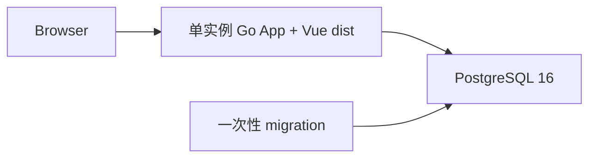

# CoinSphere

CoinSphere 是以可视化工作流为核心、由编译期可信插件提供业务能力的个人自托管量化平台。当前系统采用 Vue 3、单实例 Go 模块化单体和 PostgreSQL 16；超级管理员可以运行批次、事件与连续流工作流，普通用户通过固定范围的共享结果完成观察与授权操作。

## 当前能力

| 能力                                 | 当前入口        | 状态                                              |
| ------------------------------------ | --------------- | ------------------------------------------------- |
| 登录、用户、角色、菜单               | Web             | 可用，不开放公开注册                              |
| 系统监控                             | Web + `/api/v1` | 可用，展示 Go、HTTP、PostgreSQL 和 migration 状态 |
| 本地插件校验、安装、升级和卸载       | CLI             | 可用，编译期静态注册                              |
| 工作流、修订、事件、批次和活动 API   | `/api/v1`       | 超级管理员可用；Webhook 使用独立 Secret           |
| Schema 工作台、人工任务和历史制品    | Web             | 可用；移动端提供只读活动视图                      |
| Connector、AI 与连续流               | 工作流节点      | 默认外部域名白名单为空，不含交易私有接口          |
| Quant 指标、策略、信号与通用回测     | 工作流 + 结果页 | 通过 `venue` 使用任意行情 Provider                |
| Binance 行情、Paper 与真实交易       | 工作流 + 插件页 | Spot/USD-M；真实交易完整实现但默认关闭            |
| Notification 与共享结果              | 工作流 + 结果页 | 站内幂等投递、固定范围授权与移动端审批            |
| 旧工作流、新闻、策略、交易和通知接口 | -               | 已从公开运行面移除                                |

详细操作、接口语义、插件契约和迁移步骤见[设计与运行手册](docs/design.md)。

## 架构



生产部署只运行一个包含 Vue 静态产物的 Go App 容器；一次性 migration 复用同一镜像，并连接服务器现有 PostgreSQL 16 的独立 `coinsphere_go` 数据库。系统不依赖 Redis、消息中间件或 Kubernetes。核心 schema 保存认证、RBAC、菜单、审计、插件生命周期、工作流执行历史和制品引用；压缩制品保存在 Backend 持久目录。

## 快速启动

推荐使用 Docker Compose。需要 Docker Engine 或 Docker Desktop，并支持 Compose v2。

Linux/macOS：

```bash
export COINSPHERE_AUTH__SECRET_KEY="$(openssl rand -hex 32)"
docker compose up -d --build
docker compose ps
```

PowerShell：

```powershell
$bytes = New-Object byte[] 32
[Security.Cryptography.RandomNumberGenerator]::Create().GetBytes($bytes)
$env:COINSPHERE_AUTH__SECRET_KEY = [BitConverter]::ToString($bytes).Replace('-', '').ToLowerInvariant()
docker compose up -d --build
docker compose ps
```

浏览器打开 <http://localhost:8080>。初始超级管理员用户名是 `coinsphere`，密码使用 `COINSPHERE_AUTH__BOOTSTRAP_ADMIN_PASSWORD` 配置；首次登录后立即在“用户管理”中修改密码。`COINSPHERE_AUTH__SECRET_KEY` 必须长期保持一致，变更后已有登录令牌会失效。

生产或共享环境必须同时设置 `COINSPHERE_AUTH__BOOTSTRAP_ADMIN_PASSWORD`；只有明确设置 `COINSPHERE_ALLOW_INSECURE_BOOTSTRAP=1` 时才允许使用本地默认密码。

本地 Compose 会启动 `postgresql`、一次性 `migrate` 和内置 Web 产物的 `backend`。停止服务不会删除数据：

```bash
docker compose down
```

完整安装、首次配置、备份和排障步骤见[设计与运行手册](docs/design.md)。

## 目录

```text
backend/             Go App、版本化 migration、工作流与系统模块
frontend/            Vue 3 + Vite Web
deploy/production/   生产 Compose 模板
docs/                统一设计与运行手册
scripts/             验证、发布和部署脚本
```

## 开发

本地工具链为 Go 1.26.6、Node.js 24、pnpm 10.33 和 PostgreSQL 16。全量验证：

```powershell
.\scripts\verify.ps1
```

```bash
./scripts/verify.sh
```

按模块启动与诊断、数据库重建和迁移导入见[设计与运行手册](docs/design.md)。

## 文档

- [设计与运行手册](docs/design.md)：架构、插件、权限、页面、Graph v3、迁移、质量门禁和运维边界

## 安全边界

- 不把真实 API Key、Secret、令牌、DSN 或生产配置提交到仓库、日志、Issue、PR 或 AI 上下文。
- Codex、CI 和工作流不接触真实交易密钥，不启用 Live 开关，也不解除全局急停。
- 工作流和通用 HTTP 节点不能调用交易所私有接口、创建交易命令或绕过风控。
- 新交易能力默认关闭；缺少完整风控、匹配对账、管理员授权或 Owner 手工放行时保持禁用。
- 个人部署应优先使用 Paper。任何私有交易能力必须先建立独立 ADR、安全边界、观察证据和用户手工放行。
