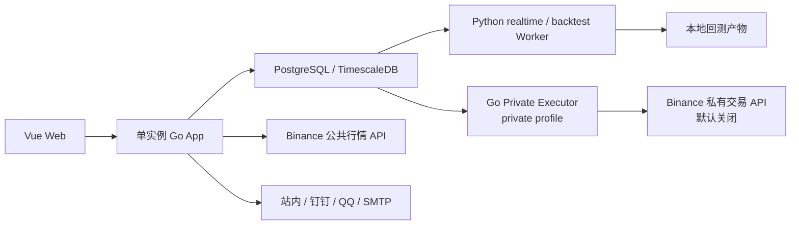

# CoinSphere

CoinSphere 是面向个人自托管和少量受邀用户的 Binance 低频量化平台。项目采用模块化单体架构，在一套系统内提供后台管理、RBAC、工作流、行情、策略、回测、信号和受控交易能力。

> 当前正式验收边界是 Paper 模拟交易和离线契约。Testnet、Spot Live 与 USD-M Live 的私有运行时代码已经实现，但默认关闭，也未完成 Binance 环境晋级；部署完成不等于允许真实交易。

## 当前能力

| 能力 | 当前入口 | 状态 |
| --- | --- | --- |
| 登录、用户、角色、菜单 | Web | 可用，不开放公开注册 |
| 工作流定义、任务定义、执行记录 | Web | 可用，仅负责粗粒度编排 |
| 新闻、推送、AI 模型、智能体、通知渠道 | Web | 可用 |
| Paper 账户、风控、持仓、订单、意图和账本 | Web | 可用，推荐的个人使用方式 |
| Binance 品种、K 线、自选 | Web + `/api/v1` | 可用，元数据按工作流同步 |
| 策略、回测、实时信号和人工决策 | Web + `/api/v1` | 可用，信号叠加在 K 线上展示 |
| Testnet、Spot Live、USD-M Live | Web + `/api/v1` | 默认关闭，尚未生产放行 |

详细操作见[使用手册](docs/user-guide.md)，接口语义见[公共契约](docs/contracts/README.md)。

## 架构



Go App 负责 API、认证/RBAC、工作流、公共行情、信号协调、通知和 Paper 执行；Worker 在一个进程内用 realtime/backtest 两个独立槽位负责策略计算与回测；Private Executor 是唯一允许访问交易所私有接口的组件，默认不部署。所有组件通过 PostgreSQL/TimescaleDB 协作，不依赖 Redis、消息中间件或 Kubernetes。完整设计见[架构说明](docs/architecture/overview.md)。

## 快速启动

推荐使用 Docker Compose。需要 Docker Engine 或 Docker Desktop，并支持 Compose v2。

Linux/macOS：

```bash
export COINSPHERE_AUTH__SECRET_KEY="$(openssl rand -hex 32)"
docker compose up -d --build
docker compose ps
```

PowerShell：

```powershell
$bytes = New-Object byte[] 32
[Security.Cryptography.RandomNumberGenerator]::Create().GetBytes($bytes)
$env:COINSPHERE_AUTH__SECRET_KEY = [BitConverter]::ToString($bytes).Replace('-', '').ToLowerInvariant()
docker compose up -d --build
docker compose ps
```

浏览器打开 <http://localhost:8080>。初始超级管理员是 `coinsphere` / `coinsphere`；首次登录后立即在“用户管理”中修改密码。`COINSPHERE_AUTH__SECRET_KEY` 必须长期保持一致，变更后已有登录令牌会失效。

Compose 会启动 `timescaledb`、一次性 `migrate`、`backend`、单进程双槽位 `worker` 和 `web`。停止服务不会删除数据：

```bash
docker compose down
```

完整安装、首次配置、备份和排障步骤见[使用手册](docs/user-guide.md)。

## 目录

```text
backend/             Go App、Executor、迁移和领域模块
frontend/            Vue 3 + Vite Web
worker/              Python 实时计算与回测 Worker
deploy/production/   生产 Compose 模板
docs/                架构、契约、开发计划、质量门禁和 Runbook
scripts/             验证、发布和部署脚本
```

## 开发

本地工具链为 Go 1.26、Node.js 24、pnpm 10.33、Python 3.12、uv 和 PostgreSQL/TimescaleDB。全量验证：

```powershell
.\scripts\verify.ps1
```

```bash
./scripts/verify.sh
```

按模块启动与诊断见[本地开发手册](docs/runbooks/development.md)，数据库变更见[迁移手册](docs/runbooks/database-migrations.md)。

## 文档

- [使用手册](docs/user-guide.md)：安装、页面操作、Paper、备份、升级和排障
- [架构说明](docs/architecture/overview.md)：系统边界、组件职责和关键数据流
- [公共契约](docs/contracts/README.md)：`/api/v1` 接口和交易安全语义
- [开发计划](docs/roadmap/README.md)：能力顺序、完成标准和晋级门禁
- [质量门禁](docs/quality/quality-gates.md)：测试与验收要求
- [发布与回滚](docs/runbooks/release.md)：手工发布、固定 digest 部署和回滚

## 安全边界

- 不把真实 API Key、Secret、令牌、DSN 或生产配置提交到仓库、日志、Issue、PR 或 AI 上下文。
- Codex、CI 和工作流不接触真实交易密钥，不启用 Live 开关，也不解除全局急停。
- 工作流和通用 HTTP 节点不能调用交易所私有接口、创建交易命令或绕过风控。
- 新交易能力默认关闭；缺少完整风控、匹配对账、管理员授权或 Owner 手工放行时保持禁用。
- 个人部署应优先使用 Paper。启用任何私有交易能力前，先完成对应开发计划门禁和独立安全评审。
