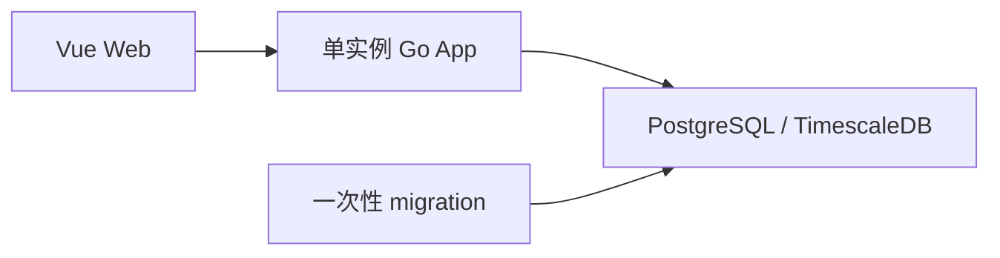

# CoinSphere

CoinSphere 正在重构为以可视化工作流为核心、由编译期插件提供业务能力的通用平台。项目保持 Vue、Go 模块化单体和 PostgreSQL/TimescaleDB 技术栈。

> V2 已完成 P0，并开始交付 P1。当前可通过超级管理员 API 创建最小批处理工作流、保存不可变修订并执行 start/pause/archive；画布和批次执行仍按[路线图](docs/roadmap/README.md)开发。

## 当前能力

| 能力                                 | 当前入口        | 状态                                              |
| ------------------------------------ | --------------- | ------------------------------------------------- |
| 登录、用户、角色、菜单               | Web             | 可用，不开放公开注册                              |
| 系统监控                             | Web + `/api/v1` | 可用，展示 Go、HTTP、PostgreSQL 和 migration 状态 |
| 本地插件校验、安装、升级和卸载       | CLI             | 可用，编译期静态注册                              |
| 工作流、修订和生命周期 API           | `/api/v1`       | 超级管理员可用；当前仅支持最小 blank 批处理图     |
| V2 工作流工作台和批次执行            | -               | 按 [V2 路线图](docs/roadmap/README.md)开发中      |
| 旧工作流、新闻、策略、交易和通知接口 | -               | 已从公开运行面移除                                |

详细操作见[使用手册](docs/user-guide.md)，接口语义见[公共契约](docs/contracts/README.md)。

## 架构



默认部署只包含 Web、Go App、一次性 migration 和 TimescaleDB，不依赖 Redis、消息中间件或 Kubernetes。核心 schema 当前保存认证、RBAC、菜单、审计、插件生命周期以及工作流修订和运行实例。

## 快速启动

推荐使用 Docker Compose。需要 Docker Engine 或 Docker Desktop，并支持 Compose v2。

Linux/macOS：

```bash
export COINSPHERE_AUTH__SECRET_KEY="$(openssl rand -hex 32)"
docker compose up -d --build
docker compose ps
```

PowerShell：

```powershell
$bytes = New-Object byte[] 32
[Security.Cryptography.RandomNumberGenerator]::Create().GetBytes($bytes)
$env:COINSPHERE_AUTH__SECRET_KEY = [BitConverter]::ToString($bytes).Replace('-', '').ToLowerInvariant()
docker compose up -d --build
docker compose ps
```

浏览器打开 <http://localhost:8080>。初始超级管理员是 `coinsphere` / `coinsphere`；首次登录后立即在“用户管理”中修改密码。`COINSPHERE_AUTH__SECRET_KEY` 必须长期保持一致，变更后已有登录令牌会失效。

Compose 会启动 `timescaledb`、一次性 `migrate`、`backend` 和 `web`。停止服务不会删除数据：

```bash
docker compose down
```

完整安装、首次配置、备份和排障步骤见[使用手册](docs/user-guide.md)。

## 目录

```text
backend/             Go App、V2 基线 migration 与系统管理模块
frontend/            Vue 3 + Vite Web
plugins/             测试插件与后续官方插件源码
deploy/production/   生产 Compose 模板
docs/                架构、契约、开发计划、质量门禁和 Runbook
scripts/             验证、发布和部署脚本
```

## 开发

本地工具链为 Go 1.26、Node.js 24、pnpm 10.33 和 PostgreSQL/TimescaleDB。全量验证：

```powershell
.\scripts\verify.ps1
```

```bash
./scripts/verify.sh
```

按模块启动与诊断见[本地开发手册](docs/runbooks/development.md)，数据库变更见[迁移手册](docs/runbooks/database-migrations.md)。

## 文档

- [使用手册](docs/user-guide.md)：安装、系统管理、插件、备份、升级和排障
- [架构说明](docs/architecture/overview.md)：系统边界、组件职责和关键数据流
- [公共契约](docs/contracts/README.md)：`/api/v1`、插件 SDK 和生命周期语义
- [开发计划](docs/roadmap/README.md)：能力顺序、完成标准和晋级门禁
- [质量门禁](docs/quality/quality-gates.md)：测试与验收要求
- [发布与回滚](docs/runbooks/release.md)：手工发布、固定 digest 部署和回滚

## 安全边界

- 不把真实 API Key、Secret、令牌、DSN 或生产配置提交到仓库、日志、Issue、PR 或 AI 上下文。
- Codex、CI 和工作流不接触真实交易密钥，不启用 Live 开关，也不解除全局急停。
- 工作流和通用 HTTP 节点不能调用交易所私有接口、创建交易命令或绕过风控。
- 新交易能力默认关闭；缺少完整风控、匹配对账、管理员授权或 Owner 手工放行时保持禁用。
- 个人部署应优先使用 Paper。启用任何私有交易能力前，先完成对应开发计划门禁和独立安全评审。
