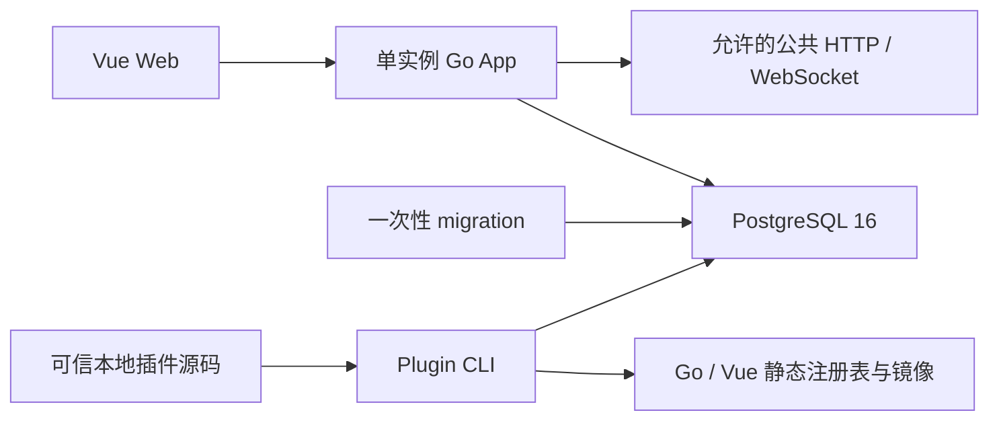
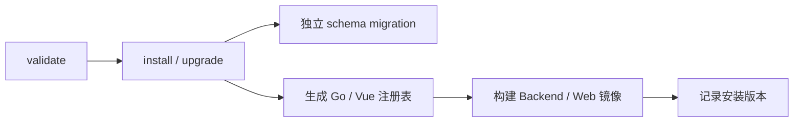

# CoinSphere 架构概览

## 当前边界

CoinSphere 是工作流优先、编译期插件驱动的个人自托管平台。V2 P0-P4 代码基线具备不可变修订、Schema 工作台、批处理/事件/连续流模式、Run 检查点恢复、人工等待、结构化 Loop、诊断重放、节点多行日志、Connector/AI、Binance 公共行情、可信 Go 策略、回测、Paper、通知、共享结果与内容寻址制品。

- 只支持 PostgreSQL 16，领域时间统一使用 UTC。
- 价格、数量、金额和费率使用 Decimal；账务值禁止使用 `float64`。
- 不提供旧数据、旧接口、多数据库、Python Worker 或 Private Executor 兼容层。
- Testnet/Live 不属于当前阶段，任何部署都不会自动启用真实交易。

## 运行拓扑

生产 Compose 只运行 Web 和 Go App，一次性 migration 连接服务器现有 PostgreSQL 16 的独立数据库。系统不依赖 Redis、消息代理、Kubernetes、动态插件进程或运行时目录扫描。

## 组件职责

### Vue Web

Web 提供登录、系统监控、用户、角色、菜单管理、超级管理员使用的 Schema 工作流工作台，以及普通用户可访问的共享结果检查台。工作流列表只呈现版本和 `已激活/未激活/异常` 状态；每行日志入口可按最近 24 小时、UTC 时间、运行状态和关键词检索 Run。详情复用原工作流画布，展示真实节点尝试、脱敏输入输出摘要和节点多行日志。Paper 结果页在桌面和移动端提供信号审批、脱敏运行状态及白名单操作。

### Go App

Go App 是单一后端进程，负责：

- Access Token 认证、RBAC、统一 Problem Details 和审计。
- 系统管理、健康检查、HTTP 指标与数据库就绪检查。
- 启动时加载编译进二进制的插件注册表。
- 暴露 SDK 的 Action、Trigger、作用域路由和结果页描述符契约。
- 向超级管理员提供节点 Schema 目录、工作流图校验、不可变修订、生命周期和 Run 操作。
- 从 PostgreSQL 有界队列领取固定修订 Run，在 `stream`/`compute` 池执行核心或插件 Action，并原子保存 RunNode、RunCheckpoint 和节点状态。
- 持久化 CloudEvents、投递和 Outbox，按分区顺序调度事件 Run，并管理长运行 Trigger 的取消、背压和重启扫描。
- 管理持久人工任务、结构化 Loop、标准失败事件和固定输入/修订的诊断重放。
- 提供 Run 搜索、事件摘要、完整节点路径、节点持久日志和经过 SHA-256 校验的 gzip 制品下载，并按工作流保留期清理终态历史。
- `core.schedule` 支持 60 至 86400 秒间隔，或带 IANA 时区的六段 Cron；服务恢复后最多补一次漏跑，再推进到下一未来时刻。
- 内置 Connector/AI 只通过精确域名白名单和公网 DNS 校验访问外部接口；环境代理不参与拨号。
- 内置 Quant 合并相同公共行情订阅，使用 UTC/Decimal 保存闭合 K 线，并让实时评估与回测调用同一可信 Go 策略。
- 内置 Quant 通过 `official.quant.sync_instruments` 原子替换每个工作流的过滤后币种快照；全局目录取所有工作流来源并集，K 线连接和重连不再刷新元数据。
- 内置 Quant 将策略目标持久化为可取代信号，经人工或显式自动决策、公共报价复核和完整 Paper 风控后原子写入订单、成交、费用、账本与持仓投影。
- 内置 Notification 以稳定操作键持久化站内投递；核心 ResultView 固定插件页面、范围、过滤器、操作白名单及用户/角色授权。

`active` 表示工作流允许手工/定时 Run 入队、事件投递或连续流 Trigger 运行；`deactivate` 取消 Trigger 但不强制终止当前 Action，Action 完成后 Run 从检查点续跑。Trigger 异常退出会进入 `error`；管理员先停用恢复为 `inactive`，再显式激活。普通用户不能访问工作流 API，也不能从 ResultView 响应得到固定 scope、filter 或源 workflow ID。

### PostgreSQL

数据库当前保存认证、RBAC、菜单、i18n、审计、插件安装状态和引用，以及工作流、修订、密钥、CloudEvent、投递、Outbox、Run、RunNode、节点日志、RunCheckpoint、人工任务、制品清单、节点状态和 ResultView 授权。`workflow_runtimes` 只保存并发、积压和定时调度字段。`plugin_quant` schema 使用普通表与联合索引保存品种、工作流品种来源、闭合 K 线、回测摘要、信号及 Paper 账户事实；`plugin_notification` 保存站内投递。金融值使用 `NUMERIC(38,18)`。订单、成交、费用和账本事实不可变，账户与持仓投影可从事实幂等重建。

应用启动只校验 migration 版本。核心 DDL 由一次性 migration 命令执行，插件 DDL 由生命周期 CLI 在维护窗口执行。

## 插件静态边界

插件是参与主 Go 进程和主 Vite 前端编译的完全可信本地源码，不是安全沙箱。

- `coinsphere-plugin.json` 固定插件 ID、SemVer、Core/SDK 约束、源码入口、migration 和贡献类型。
- SDK 注册 Action/Trigger、JSON Schema、作用域 API 和结果页；重复插件 ID、节点类型、路由或结果页会被拒绝。
- `WorkflowScope`、`ResultScope` 和 `SystemScope` 由核心注入，插件路由不得自行从查询参数恢复授权范围。
- 安装或升级失败会恢复源码输入、生成文件和已执行的插件 migration；命令不启动候选镜像。
- 卸载在有活动引用时拒绝并保留插件 schema；`purge-data` 仅在已卸载、无任何引用且确认文本匹配时删除数据。
- 同一 checkout 的维护命令当前要求串行执行；出现多维护端并发需求时再增加跨进程锁。

## 安全边界

- 匿名 HTTP 入口只有登录、健康检查和静态资源；其他已注册 API 要求登录及对应权限。
- 插件仅接受本地可信源码；项目不下载插件、不校验远程签名、不热加载共享库。
- 日志不得记录密钥、令牌、DSN、原始载荷或个人数据。
- AI、工作流和通用 HTTP 节点不得调用交易所私有接口或绕过风控。
- Connector/AI 外部访问默认关闭，只接受显式精确公共域名；授权 Binance 请求、私有/未知端点和非公网解析结果直接拒绝。
- 真实交易所凭据不得进入代码、测试、CI、Issue、PR 或 AI 上下文。

目标架构见[工作流平台 V2](workflow-platform-v2.md)，当前决策见 [ADR-0002](decisions/0002-compile-time-plugin-workflow-platform.md)，接口语义见[公共契约](../contracts/README.md)。
