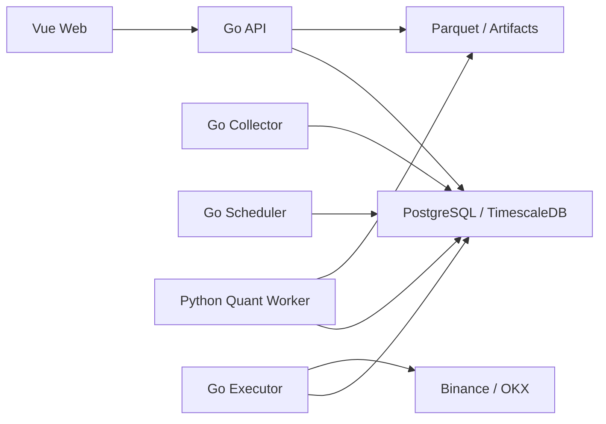

# 目标架构

## 原则

- 保持模块化单体，在明确出现独立扩缩容或故障隔离需求前不拆微服务。
- Go 平台拥有账户、风控、订单路由和审计；Python Worker 只运行数据集与回测任务。
- PostgreSQL 是业务事实源，Parquet 数据集不可变，工作流只传递资源 ID。
- 模拟与实盘共享代码契约，但账户、凭据、订单、仓位和风控状态强逻辑隔离。

## 运行拓扑

同一 Go 代码库最终构建 `api`、`collector`、`scheduler`、`executor` 四种进程。首版异步任务使用 PostgreSQL `FOR UPDATE SKIP LOCKED`，领域事件使用事务 Outbox，不引入额外消息中间件。

Go 服务使用 `signal.NotifyContext` 为 `SIGINT`/`SIGTERM` 建立唯一进程根 Context。HTTP 请求、Runtime 循环和执行、数据库操作及 WebSocket 连接从该根 Context 接收取消；进程停止接收新工作后，在 30 秒应用总预算内完成有界收尾，Compose 提供 40 秒终止宽限。

A1-2 使用独立 `worker_tasks` 队列表，以 UUIDv7 字符串任务 ID、七态状态、唯一租约 ID、租约到期、心跳和取消时间承载 Worker 协议；该表不复用 Go 工作流的 `workflow_executions`。Python Worker 在单个 PostgreSQL 事务中通过 `FOR UPDATE SKIP LOCKED` 认领并递增尝试次数，所有活跃状态写入同时匹配任务 ID、`lease_id`、合法前态与数据库时间。过期的 `claimed/running` 按剩余尝试次数重排或失败；`cancelRequested` 不再续租，并在租约过期或独立 4 秒取消截止时间到达时只能进入 `canceled`，因此 Owner 在确认取消前崩溃也不会突破 5 秒契约。旧租约不能续租或提交终态。开发 Compose 通过仅内部可见的 PostgreSQL 网络启用该消费者；生产 Release 暂不部署 Worker，数据集与双回测执行能力按 A3 至 A5 的阶段顺序引入。

A1-3 的逻辑版本 `00003` 分别提供 SQLite 与 PostgreSQL SQL，在保留既有事件和入站引用的前提下，为 `domain_event_outbox` 建立 `pending/claimed/processed/failed/dead_letter` 五态，以及最大尝试、唯一租约、Owner、租约到期、认领、错误分类、死信和告警时间契约。数据库约束保证只有 `claimed` 持有完整活跃租约，尝试次数不越界，终态时间一致；索引覆盖待认领、过期恢复、未告警死信和终态留存。存储层使用单条 DML 完成候选选择、批量更新与返回：PostgreSQL 通过 `FOR UPDATE SKIP LOCKED` 并发认领，SQLite 通过同一 WAL 文件的原子写语句串行多个认领者；每行由数据库生成唯一 token，租约和 fencing 均使用数据库时间。终态写同时匹配事件 ID、token、Owner、认领代次与未过期时间；过期时保留尝试次数，未耗尽事件回到 `pending`，耗尽事件进入 `dead_letter`。现有 dispatcher 尚未接入该存储 API，续租、指数退避、订阅失败重试和死信告警仍由后续独立 PR 实现。

数据库 schema 通过后端镜像内的独立 migration 二进制演进，服务进程不负责生产迁移。当前仍保留 GORM `AutoMigrate`；应用检测到 `00003` 字段后以同表名占位模型隔离 Outbox DDL，防止 SQLite 重建表并删除版本化约束，同时保留关系元数据以补齐 PostgreSQL 空库外键，其余业务模型和关系继续迁移。A1-10 才完成其余业务 schema 基线、存量校准和启动路径切换。详细决策见 [ADR-0002](./decisions/0002-versioned-sql-migrations.md)。

## 领域边界

- `marketdata`：交易所公共连接、品种、行情规范化、补数和数据质量。
- `dataset`：不可变 Manifest、Parquet 分区、校验和和引用保护。
- `news`：来源适配、去重、许可策略、实体与情绪标注。
- `strategy`：草稿、多文件策略包、不可变版本和参数 Schema。
- `backtest`：计算任务、双引擎适配、统一账本和统计指标。
- `trading`：账户、订单、成交、仓位、余额和交易所私有连接。
- `risk`：订单前检查、账户级限制、急停和风险事件。
- `workflow`：补数、批量回测、报告和通知等粗粒度编排。
- `platform`：认证、RBAC、配置、审计、可观测性和任务基础设施。
