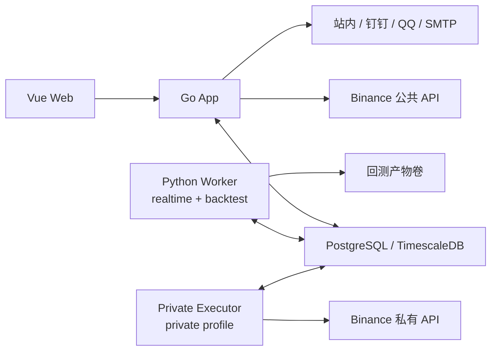
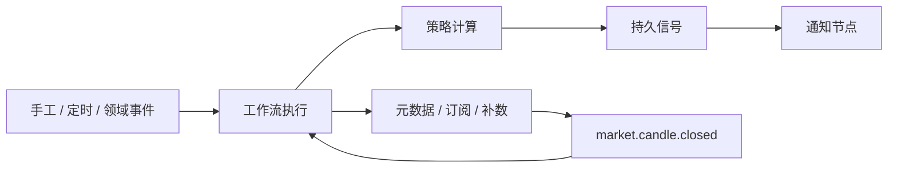

# CoinSphere 架构概览

## 产品边界

CoinSphere 是个人自托管的 Binance 低频量化平台。系统以可视化工作流为主要操作入口，覆盖行情元数据、K 线订阅与补数、策略计算、信号展示、通知和 Paper 执行。

- 只支持 PostgreSQL/TimescaleDB、Binance Spot 与 USD-M、交易所原生周期和闭合 K 线。
- 不开放注册；RBAC 控制页面和 API，用户资源按 Owner 隔离。
- 价格、数量、金额和费率使用 Decimal，领域时间统一使用 UTC。
- Testnet/Live 默认关闭；部署、启用策略或执行工作流都不等于放行真实交易。

## 运行拓扑

生产由一个独立的 `coinsphere-go` Compose 项目运行 Web、Go App、Python Worker 和 TimescaleDB。它不加入其他应用的 Compose 项目，也不依赖 Redis、消息中间件或 Kubernetes。Private Executor 只有在单独放行后才通过 `private` profile 启动。

## 组件职责

### Web

Vue Web 提供工作流工作台、X6 工作流编辑器、执行回放、行情元数据、K 线与信号图表、策略、账户和系统管理页面。页面沿用同一应用外壳和 RBAC 菜单，不维护第二套导航或状态模型。

### Go App

Go App 是单一后端进程，包含：

- HTTP/WebSocket API、认证、RBAC 和审计。
- 工作流定义、触发、调度、执行状态与 Outbox 分发。
- Binance 公共元数据、K 线实时订阅和历史补数。
- 通知渠道、信号协调和 Paper Executor。

Go App 可以访问 Binance 公共接口，但不能调用私有交易接口。Paper 意图在 App 内执行；Testnet/Live 意图只能由 Private Executor 处理。

### Python Worker

Worker 单进程运行两个固定槽位：

- `realtime` 处理闭合 K 线触发的策略任务。
- `backtest` 在受限子进程中处理回测任务。

两个槽位共享 PostgreSQL 任务协议，但互不占用执行能力。Worker 不持有通知或交易凭据，不调用交易所私有接口。

### PostgreSQL / TimescaleDB

数据库是唯一持久事实源：

- 工作流定义、执行、节点状态、调度和订阅意图。
- 行情品种、Ticker、K 线和用户自选。
- 策略版本、实例、任务、回测、信号和产物索引。
- 用户、权限、通知、Outbox、Paper/Private 交易事实和投影。

TimescaleDB 管理 K 线 hypertable、压缩与保留策略。服务启动只校验 migration 版本，DDL 只由独立 migration 命令执行。

## 工作流模型

工作流负责粗粒度编排：

- `market.metadata.sync` 读取全局同步范围、Binance REST 地址和可选出站代理并实时同步元数据；代理同时作用于公共 REST 与 WebSocket。
- `market.candles.subscribe` 保存激活工作流的订阅意图。
- `market.candles.backfill` 执行指定 UTC 窗口补数。
- `strategy.evaluate` 以同步或异步方式创建幂等策略任务。
- `notify` 统一使用站内、钉钉、QQ 和 SMTP 渠道。

闭合 K 线发布 `market.candle.closed`，策略成功发布 `strategy.signal.created`。逐 K 线写入、Worker 执行循环和交易执行不进入工作流引擎，避免把高频状态机塞进画布。

## 关键数据流

1. 元数据工作流由每小时调度或用户手工触发，按全局市场和报价资产范围同步 Binance 品种。
2. 行情管理器合并自选、启用策略实例和激活工作流订阅，实时保存闭合 K 线并发布事件。
3. 工作流的策略节点用固定幂等键创建 Worker 任务；Worker 写入信号和 Outbox 事件。
4. Web 按品种、周期和策略查询 K 线与信号，展示目标仓位线及 BUY/SELL/FLAT 标记。
5. Paper 信号可产生持久交易意图；Go App 在执行前重新检查急停、账户、授权、风控和行情新鲜度。

## 安全边界

- 工作流、AI 和通用 HTTP 节点不得调用 Binance 私有接口或创建交易命令。
- Private Executor 是唯一可解密交易凭据和发送私有请求的组件。
- 新交易能力默认关闭；缺少完整风控、匹配对账和用户放行时保持禁用。
- 日志不记录密钥、令牌、DSN、原始外部载荷或个人数据。
- 数据库、上传文件和回测产物使用独立持久卷；部署回滚不自动执行 migration Down。

当前架构决策见 [ADR-0001](decisions/0001-workflow-modular-monolith.md)，接口语义见[公共契约](../contracts/README.md)。
