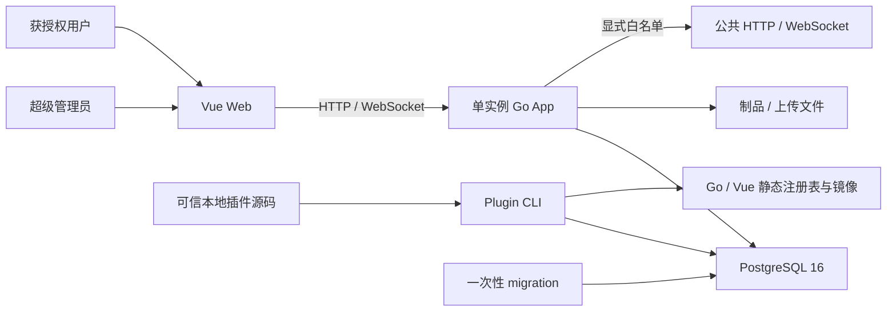
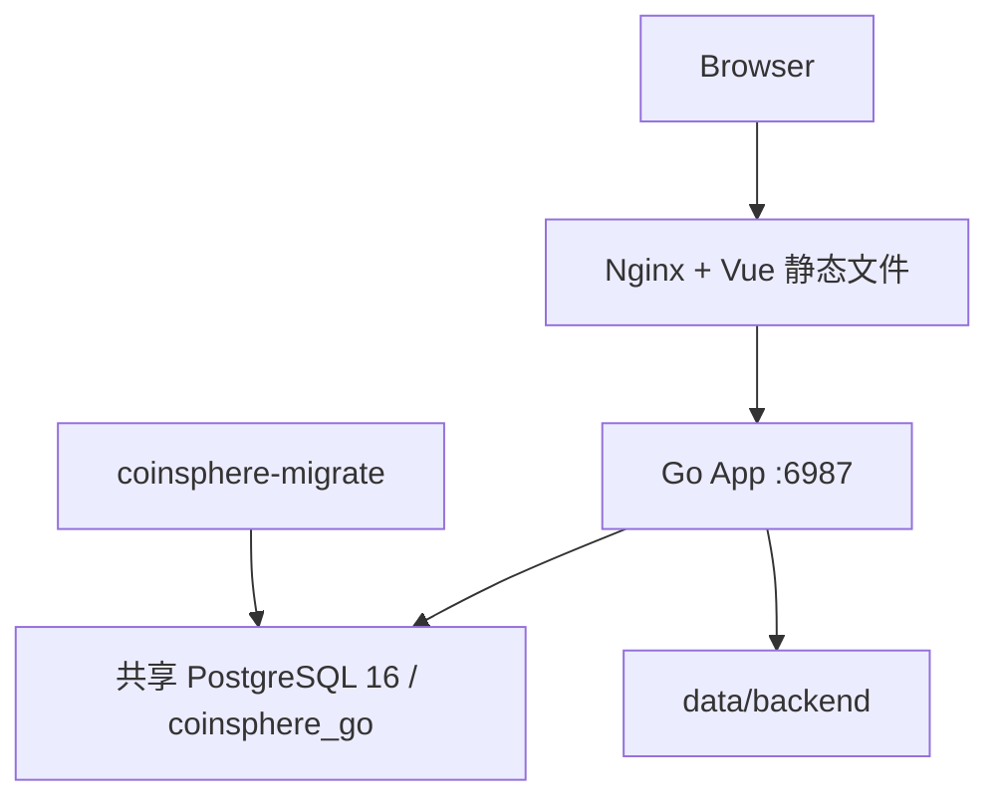
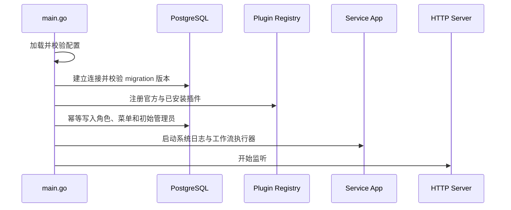
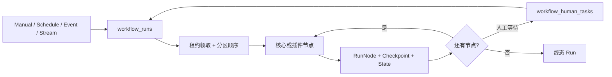
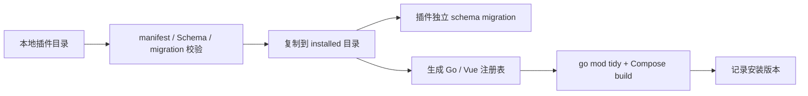
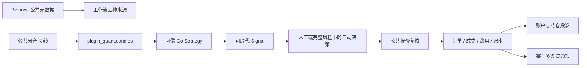

# CoinSphere 当前架构

本文描述当前代码和部署实际采用的架构。历史决策及被替代方案保存在 [ADR](decisions/0002-compile-time-plugin-workflow-platform.md)，接口字段和状态语义以[公共契约](../contracts/README.md)为准，目录与修改入口见[代码结构](../code-structure.md)。

## 1. 系统定位与边界

CoinSphere 是面向个人自托管场景的工作流驱动量化平台。用户通过 Vue Web 配置、运行和观察工作流；单实例 Go App 承担 HTTP API、权限、工作流执行、插件运行和领域服务；PostgreSQL 16 是唯一业务数据库和持久队列。

当前运行面包括：

- 登录、用户、角色、菜单、系统监控和结构化系统日志。
- 不可变工作流修订、Schema 工作台、批处理、事件和连续流执行。
- Run 队列、节点尝试、检查点、人工任务、诊断重放、节点日志和内容寻址制品。
- 编译期可信插件，以及内置 Connector、AI、Quant、Notification 和 QQ 插件。
- Binance Spot/USD-M 公共行情、可信 Go 策略、回测、信号、Paper 账户和通知。
- 固定范围的共享结果视图及授权操作。
- 仅超级管理员可用的平台智能助手、全局模型配置和工作流草稿生成。

当前明确不提供微服务、多实例调度、Redis、Kafka、Kubernetes、动态插件、插件市场、不可信代码沙箱、Python Worker、Testnet、Live 或交易所私有 API。旧接口、旧数据和旧工作流图没有兼容层。

平台助手位于 Core，而不是插件。HTTP 层只向 `R_SUPER` 暴露模型配置、会话、流式对话和工作流确认接口；Service 层负责有界上下文、OpenAI-compatible 工具循环、核心只读查询、插件查询调度和工作流方案校验。PostgreSQL 保存全局模型配置、用户会话与消息，提案随助手消息元数据保存。

插件仍拥有自身领域数据。Quant 通过 SDK `assistantQueries` 暴露有界只读摘要；Connector、Notification 与 `official.ai` 不注册查询。工作流方案使用实时 Core/插件节点目录，确认时再次校验目录摘要和完整图，并在同一事务创建 `inactive` 工作流、初始修订与运行时；平台不会自动激活或运行。

## 2. 系统上下文

超级管理员可以管理系统、工作流和共享结果；普通用户不能访问工作流管理面，只能访问已授权且仍为 active 的 ResultView。外部网络访问默认关闭，仅 Connector/AI 和 Quant 公共行情按各自边界访问明确允许的公共目标。

## 3. 运行与部署拓扑

本地 `docker-compose.yml` 包含 PostgreSQL、一次性 migration、Backend 和 Web，便于在独立开发数据库上启动。生产 `deploy/production/compose.yaml` 只运行 Backend 和 Web，通过外部 Docker 网络连接服务器 PostgreSQL 16 中独立的 `coinsphere_go` 数据库；migration 在启动应用前由目标 Backend 镜像执行。

Web 是唯一面向浏览器的入口，反向代理 `/api`、健康检查和 WebSocket 到 Backend。Backend 的持久目录保存上传文件和按 SHA-256 寻址的 gzip 制品；数据库保存制品清单与引用。停止或回滚应用不会自动执行 migration Down，也不会删除数据库、上传或制品。

## 4. Backend 启动与关闭

Backend 启动顺序固定，任何前置条件失败都会阻止 HTTP 服务和工作流执行器进入运行态：

启动时只校验核心 migration，不自动执行 DDL。插件注册先加载内置 Connector/AI、Quant、Notification、QQ，再加载生成的第三方注册表；插件 ID、节点类型、策略、页面和路由冲突都会使启动失败。随后系统初始化结构化日志运行时、确保内置 Quant 品种同步工作流存在，并启动工作流执行器。

收到终止信号后，同一个取消上下文停止新 HTTP 请求、连续流 Trigger 和外部 I/O。HTTP Server 有界关闭，执行器停止领取新 Run，在途 Action 通过 `context.Context` 协作取消并保存可提交的检查点；进程等待 Run 和 Trigger 收尾后关闭日志与数据库连接。

## 5. 模块职责

### 5.1 Vue Web

Web 负责登录、导航、权限感知页面、系统管理、工作流编辑与运行观察，以及插件页面和共享结果页的呈现。API 模块只负责传输和类型映射，领域状态仍由 Backend 与数据库拥有。

工作流编辑器从 `/api/v1/workflows/node-definitions` 获取核心和插件节点的 JSON Schema/UI Schema 及固定分支端口；六种 Quant 单指标节点使用同一逐项参数编辑器并通过连线组合，通知凭据使用修订级 Secret 输入，普通节点仍使用 Schema 表单。运行详情从持久 RunNode attempt 合成开始/业务/结束记录，历史页固定选择的 Run；运行详情和个人通知分别使用 `coinsphere.workflow-runs.v1` 与 `coinsphere.notifications.v1` WebSocket 接收更新。WebSocket 是进程内实时提示，不是第二份事实源。

前端插件通过生成的 `registry.generated.ts` 与内置插件表静态加入 Vite 构建。普通页面和结果页均是主应用 Vue 组件，不使用 iframe、Web Component 或运行时远程模块。

### 5.2 API 与权限

Backend 使用 Go 标准库 `net/http` 路由。除登录、健康检查、静态资源和持有工作流 Secret 的 Webhook 外，接口均要求 Access Token；管理接口再检查角色或细粒度权限。

- `/api/v1/auth/*` 管理登录、登出和短时一次性重新认证。
- `/api/v1/workflows/*`、`/api/v1/events`、`/api/v1/human-tasks` 管理工作流与运行。
- `/api/v1/result-views/*` 解析固定视图及用户/角色授权。
- `/api/v1/plugins/{pluginId}/*` 承载系统作用域插件路由。
- `/api/v1/result-views/{viewId}/plugins/{pluginId}/*` 承载结果作用域插件路由。
- `/api/v1/notification-deliveries` 和 `/api/v1/ws/notifications` 按当前登录用户隔离站内通知。
- `/api/v1/ws/workflows/{workflowId}/runs` 仅允许超级管理员使用同源 WebSocket 订阅运行更新。

错误响应统一使用 Problem Details。请求 ID 用于关联结构化日志；原始 Token、Cookie、授权头、DSN、密钥和载荷不会进入日志。

### 5.3 Service 与工作流核心

`internal/service` 拥有业务状态转换和事务边界，包括认证、系统管理、工作流定义、修订、事件、Run、Trigger、检查点、人工任务、日志、制品、ResultView 和官方领域协作。API handler 只解析信任边界输入、调用 Service 并编码响应。

工作流核心只认识通用图、核心控制节点和 SDK 契约，不实现逐 K 线计算、模型私有协议、通知投递或 Paper 账本。业务计算留在拥有该状态的插件中。

### 5.4 PostgreSQL

PostgreSQL 同时承担业务事实、持久队列、Outbox、幂等约束和恢复检查点。系统不使用独立消息代理或内存队列作为权威状态；进程内 channel 只用于唤醒和实时通知。

## 6. 工作流定义与修订

`workflows` 保存名称、生命周期和活动修订指针；`workflow_revisions` 保存不可变图快照；`workflow_runtimes` 保存并发、积压、保留期和调度字段。每次保存必须携带预期活动修订 ID，服务锁定工作流、校验完整图和密钥变更后创建递增修订并原子切换指针。

图固定包含一个主 Trigger，并使用 `batch`、`event` 或 `stream` 模式。节点保存稳定 `nodeInstanceId`、精确节点版本、普通配置、输入映射和画布位置；密钥按修订、节点实例和字段独立加密。插件节点可声明固定分支端口，执行器先用输出 `branch` 选择端口，再应用边 CEL；端口可扇出且多来源可汇合，拓扑仍保持 DAG。修订响应、日志、导出和复制不会返回密钥值。

工作流生命周期只有：

- `inactive`：不领取新 Run，也不运行长连接 Trigger。
- `active`：允许手工/定时 Run、事件投递和连续流 Trigger。
- `error`：Trigger 异常退出，需要先停用再修复并重新激活。

已创建 Run 永远固定创建时的修订。保存新修订不会改变正在排队、运行或等待的 Run。

## 7. Run 执行、检查点与恢复

Run 创建时固定工作流、修订、触发信息和可选事件。执行器从 PostgreSQL 领取租约，在有界 `stream` 或 `compute` 池运行；同一工作流、同一分区按入队顺序执行，不同分区可并发。进入人工等待后，Run 保存上下文并释放执行池和分区占用。

每个成功节点在一个事务中提交节点终态、输出检查点、制品引用和缓冲状态。失败只重试当前节点；稳定操作键与数据库唯一约束防止进程重启、节点重试或 Outbox 重投重复执行已提交副作用。租约过期的 Run 会在重启后重新排队。

取消不会强制终止 Go 代码，而是通过 `context.Context` 协作传播；取消后不再调度下游节点。诊断重放固定原始事件和修订，并复用 `notification`、`human_action`、`paper` 副作用的原检查点，避免再次产生外部或账务事实。

Run WebSocket 只发送工作流 ID、Run ID 和更新时间等轻量更新。客户端收到通知后仍从 PostgreSQL 支撑的 HTTP API 读取完整详情，因此断线或消息合并不会导致事实丢失。

## 8. 事件、Trigger 与 Outbox

外部事件使用 CloudEvents 1.0 结构化 JSON。`(source,id)` 全局去重，`partitionkey` 控制同工作流内的顺序；事件记录、匹配投递和 Run 在同一事务提交。内部失败事件先写 Outbox，再由执行器有界重试发布。

`core.schedule` 支持固定秒数或带 IANA 时区的六段 Cron，服务恢复后最多补一次漏跑。插件 `TriggerHandler` 用 Emitter 发送事件并必须响应取消与背压；服务启动时扫描 active 连续流并恢复 Trigger。

Connector/AI 的 HTTP 与 WebSocket 访问执行精确域名白名单、公共 DNS 和重定向复核，不继承环境代理。Notification 的钉钉节点和独立 QQ 插件只访问固定官方域名，SMTP 只拨号公网域名并强制 TLS 或 STARTTLS；凭据只经 SecretReader 解密。QQ Gateway Trigger 随流式工作流启停，固定订阅群聊 @ 与单聊消息并按 OpenID 分区，不保存原始载荷或鉴权扩展。Binance Quant 只访问公共行情接口，通用节点不能调用交易所私有接口。六种 Quant 判断节点各自读取一种周期的 UTC 闭合 K 线，在当前和上一检查时点确定性计算 Decimal 指标；工作流只承担 true/false 端口组合、路径进入传播和通知输入聚合，不参与逐 K 线计算。

## 9. 编译期插件

插件是参与主 Go 进程和主 Vue 应用编译的完全可信本地源码。它不是安全沙箱，拥有普通 Go 代码的进程、文件系统和数据库访问能力；SDK 作用域是开发契约，不是进程隔离。

`coinsphere-plugin.json` 声明稳定插件 ID、严格 SemVer、Core/SDK 兼容范围、Go module、Vue 入口、migration 目录和贡献类型。Backend 注册表可以接收 Action、Trigger、Strategy、Page、ResultPage 和 Route；Frontend 模块按页面 key 提供异步 Vue 组件。

插件路由只能声明以下一种作用域：

- `WorkflowScope`：SDK 已定义的工作流和节点实例范围；当前公共 HTTP 未挂载该作用域。
- `ResultScope`：由服务端 ResultView 解析固定 scope/filter、操作白名单和当前用户。
- `SystemScope`：仅超级管理员可访问的系统级插件接口。

安装和升级在维护窗口执行 migration、生成注册表并构建镜像，但不启动候选镜像。失败会恢复源码、生成文件和本次执行的插件 migration。升级必须增加版本、保持同 major，并原样保留历史 migration。卸载遇到活动引用时拒绝，成功后仍保留插件 schema；只有插件已卸载、无任何历史引用且确认文本精确匹配时，`purge-data` 才删除 schema 和安装记录。完整开发流程见[插件开发指南](../plugin-development.md)。

## 10. ResultView 与插件结果页

ResultView 是普通用户访问插件结果的唯一共享边界。创建时固定 `pluginId`、`pageKey`、经过插件 Schema 校验的 scope/filter、允许操作及用户/角色授权。固定范围不能原地修改；需要变化时创建新视图并撤销旧视图。

读取结果路由时，核心从已认证的 View 解析 `ResultScope`，忽略客户端提交的工作流范围。写操作还要同时通过 ResultView 操作白名单、RBAC 权限和领域状态校验。普通响应不暴露固定 scope/filter 或源工作流 ID。

## 11. Quant、Paper 与 Notification

Quant 将相同 `market + instrument + interval` 的公共行情订阅合并，使用 UTC 和 Decimal 保存已闭合 K 线。品种同步节点按工作流保存过滤后的来源快照，全局目录是所有工作流来源的并集。放量、价格波动、MACD、KDJ、RSI 和布林带分别由独立判断节点执行，串行 true 表达 AND、并行汇合表达 OR、false 表达反向路径。实时策略评估与回测调用同一个无状态 Go `Strategy.Evaluate`；回测按下一根 K 线开盘应用费用和滑点，大明细写入内容寻址制品。

策略目标先持久化为 Signal。默认需要人工决定；自动模式只有在总名义价值、单品种名义价值、单次操作名义价值、最大日亏损和最大回撤全部明确配置后才能启用。决定后重新取得公共报价并复核时效、步进、账户状态和全部风险上限。

Paper 订单、成交、费用和账本事实不可变，账户与持仓是可重建投影。稳定操作键保证 Run 重试不会重复记账。Notification 使用同一操作键幂等记录站内、钉钉、QQ 或 SMTP 投递；当前系统不包含真实订单、真实凭据或私有交易接口。

## 12. 数据所有权

| Schema / 存储 | 所有者 | 主要事实 |
| --- | --- | --- |
| `public` 系统表 | 认证与系统模块 | 用户、角色、菜单、权限、i18n、审计、系统日志、插件安装与引用 |
| `public` 工作流表 | 工作流核心 | 工作流、修订、密钥、运行时、事件、投递、Outbox、Run、节点、日志、检查点、人工任务、制品、节点状态 |
| `public` ResultView 表 | 结果视图模块 | 固定视图、用户授权、角色授权、撤销状态 |
| `plugin_quant` | Quant 插件 | 品种、品种来源、K 线、回测、信号、Paper 账户、订单、成交、费用、账本和持仓 |
| `plugin_notification` | Notification 插件 | 多渠道幂等投递、站内收件人与已读状态 |
| Backend 持久目录 | 制品与上传模块 | gzip 制品正文、静态文件和用户上传 |
| `plugin_<id>` | 外部插件 | 独立 migration 账本和插件自有领域数据 |

领域时间、数据库和接口统一使用 UTC。价格、数量、金额、费率和盈亏使用 Decimal；数据库采用 `NUMERIC(38,18)`，JSON 采用十进制字符串，账务值不使用 `float64`。

## 13. 一致性与失败处理

- PostgreSQL 事务同时提交业务事实、工作流状态和 Outbox，避免跨存储双写。
- 不可变修订固定 Run 输入；乐观指针拒绝并发覆盖。
- 检查点、稳定操作键和唯一约束提供至少一次执行下的业务幂等。
- 订单、成交、费用和账本保持不可变；损坏投影从事实重建，不修改事实迎合投影。
- migration 由独立命令执行；数据库版本落后或领先时应用拒绝启动。
- 无法无损回滚时恢复数据库与制品的一致备份，不伪造 migration 版本。

## 14. 安全与可观察性

- 密码使用迭代哈希；节点密钥独立加密；Access Token 可按会话撤销。
- WebSocket 要求同源 Origin、专用子协议和有效 Access Token；工作流运行订阅另要求超级管理员权限。
- Connector/AI 默认拒绝全部外部主机，且拒绝私网、IP、通配符和交易所私有目标。
- 只有状态拥有模块记录对应结构化日志，日志以 request ID、workflow ID、run ID 或 node ID 关联。
- `/health/live` 只报告进程存活；`/health/ready` 和 `/health` 检查 PostgreSQL；`/metrics` 需要登录。
- 系统日志和节点日志均限制消息、字段类型与大小，并过滤敏感字段。
- 真实 API Key、Secret、令牌、DSN、生产配置和原始载荷不得进入仓库、日志、测试、Issue、PR、CI 或 AI 上下文。

## 15. 已知限制与演进条件

- 单实例调度与 PostgreSQL 队列不面向高频交易、多租户集群或跨节点容灾；只有容量与可用性证据突破当前边界时才评估多实例和外部队列。
- Go 插件与主进程同生共死，无法强制终止忽略取消的处理器；只有出现实际隔离需求时才设计独立插件宿主。
- 插件安装需要源码复制、migration 和镜像重建，允许维护停机；当前不提供热加载或远程市场。
- 正式 Paper 观察开始前必须冻结既有 migration；冻结后核心和插件 migration 只能追加。
- Testnet、Live 和私有交易必须通过新的 ADR、安全设计、独立凭据边界、恢复证据和用户手工放行，不能由通用工作流或插件隐式开启。

## 16. 相关文档

- [代码结构](../code-structure.md)
- [插件开发指南](../plugin-development.md)
- [公共契约](../contracts/README.md)
- [使用手册](../user-guide.md)
- [本地开发与诊断](../runbooks/development.md)
- [数据库迁移](../runbooks/database-migrations.md)
- [发布与回滚](../runbooks/release.md)
