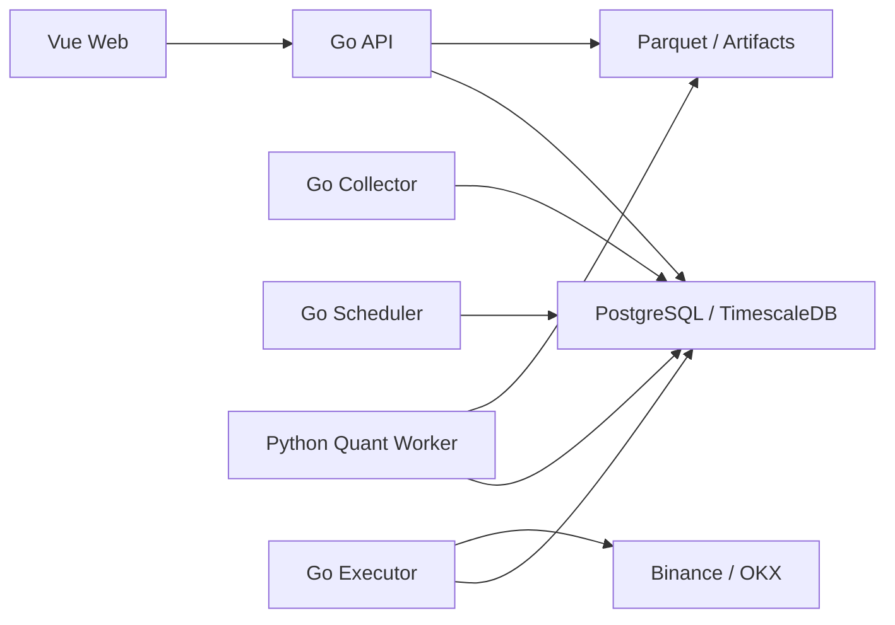

# 目标架构

## 原则

- 保持模块化单体，在明确出现独立扩缩容或故障隔离需求前不拆微服务。
- Go 平台拥有账户、风控、订单路由和审计；Python Worker 只运行数据集与回测任务。
- PostgreSQL 是业务事实源，Parquet 数据集不可变，工作流只传递资源 ID。
- 模拟与实盘共享代码契约，但账户、凭据、订单、仓位和风控状态强逻辑隔离。

## 运行拓扑

同一 Go 代码库最终构建 `api`、`collector`、`scheduler`、`executor` 四种进程。首版异步任务使用 PostgreSQL `FOR UPDATE SKIP LOCKED`，领域事件使用事务 Outbox，不引入额外消息中间件。

Go 服务使用 `signal.NotifyContext` 为 `SIGINT`/`SIGTERM` 建立唯一进程根 Context。HTTP 请求、Runtime 循环和执行、数据库操作及 WebSocket 连接从该根 Context 接收取消；进程停止接收新工作后，在 30 秒应用总预算内完成有界收尾，Compose 提供 40 秒终止宽限。

A1 基线包含独立 `worker_tasks` 队列表，以 UUIDv7 字符串任务 ID、七态状态、唯一租约 ID、租约到期、心跳和取消时间承载 Worker 协议；该表不复用 Go 工作流的 `workflow_executions`。Python Worker 在单个 PostgreSQL 事务中通过 `FOR UPDATE SKIP LOCKED` 认领并递增尝试次数，所有活跃状态写入同时匹配任务 ID、`lease_id`、合法前态与数据库时间。过期的 `claimed/running` 按剩余尝试次数重排或失败；`cancelRequested` 不再续租，并在租约过期或独立 4 秒取消截止时间到达时只能进入 `canceled`。旧租约不能续租或提交终态。开发 Compose 通过内部数据库网络让 Backend 与 Worker 共享 TimescaleDB；生产 Release 暂不部署 Worker。

基线为 `domain_event_outbox` 建立 `pending/claimed/processed/failed/dead_letter` 五态，以及最大尝试、唯一租约、Owner、租约到期、认领、错误分类、死信和告警时间契约。数据库约束保证只有 `claimed` 持有完整活跃租约，尝试次数不越界，终态时间一致；索引覆盖待认领、过期恢复、未告警死信和终态留存。存储层通过 PostgreSQL `FOR UPDATE SKIP LOCKED` 在单条 DML 中完成候选选择、批量更新与返回；每行由数据库生成唯一 token，租约、续租和 fencing 均使用数据库时间。dispatcher 仅在具备处理能力时认领下一条，慢订阅期间周期续租。失败按配置退避，未耗尽事件回到 `pending`，耗尽或租约最后一次过期进入 `dead_letter`。工作流终态和标准事件在同一短事务提交；死信先原子标记 `alerted_at` 再输出只含固定 ID 的日志。提交标记后立即崩溃仍可能漏日志，当前不宣称 exactly-once。

A1 工作流运行态复用 `(code, version)`、状态和入口唯一约束，以 PostgreSQL 事务串行同一工作流 family 的变更。新版本在锁内读取 `MAX(version)` 后分配；激活、停用、入口重建及相关状态更新使用同一个事务。任一步失败都会回滚到原 active 版本和入口集合，运行态查询只返回完整旧版本或完整新版本。

A1-5 将 `/ws/notifications` 收敛为每连接一个有限发送队列和一个 writer。Hub 在锁内按同一顺序完成非阻塞入队，队列满的慢连接原子摘表后在锁外关闭，因此并发生产者和健康连接不等待网络写入；初始未读快照预先入队并固定为 `sequence=1`。writer 独占业务帧和 RFC6455 Ping，按实际写出顺序补连续序号；读循环只处理控制帧，Pong 延长期限，Hub 关机等待全部 writer 退出。事件使用固定五字段信封，数据在入队前固化且时间统一为 UTC。握手只接受与有效 scheme、Host 和端口同源的 Origin；Vite 代理保留开发页面 Host，Nginx 保留原始端口和合法上游 scheme。该阶段不新增跨域 allowlist、Token 兼容层、依赖或 migration。

数据库 schema 通过后端镜像内的独立 migration 二进制演进。单一 `00001_a1_postgres_baseline.sql` 面向空 PostgreSQL schema 建立当前全部业务表、Worker 队列、外键、索引和状态约束；服务进程只读校验版本，不执行 DDL。Backend 与 Worker 共用同一 TimescaleDB，旧 SQLite/MySQL schema 和未投产开发数据不提供兼容层。详细决策见 [ADR-0002](./decisions/0002-versioned-sql-migrations.md)。

## 领域边界

- `marketdata`：交易所公共连接、品种、行情规范化、补数和数据质量。
- `dataset`：不可变 Manifest、Parquet 分区、校验和和引用保护。
- `news`：来源适配、去重、许可策略、实体与情绪标注。
- `strategy`：草稿、多文件策略包、不可变版本和参数 Schema。
- `backtest`：计算任务、双引擎适配、统一账本和统计指标。
- `trading`：账户、订单、成交、仓位、余额和交易所私有连接。
- `risk`：订单前检查、账户级限制、急停和风险事件。
- `workflow`：补数、批量回测、报告和通知等粗粒度编排。
- `platform`：认证、RBAC、配置、审计、可观测性和任务基础设施。
