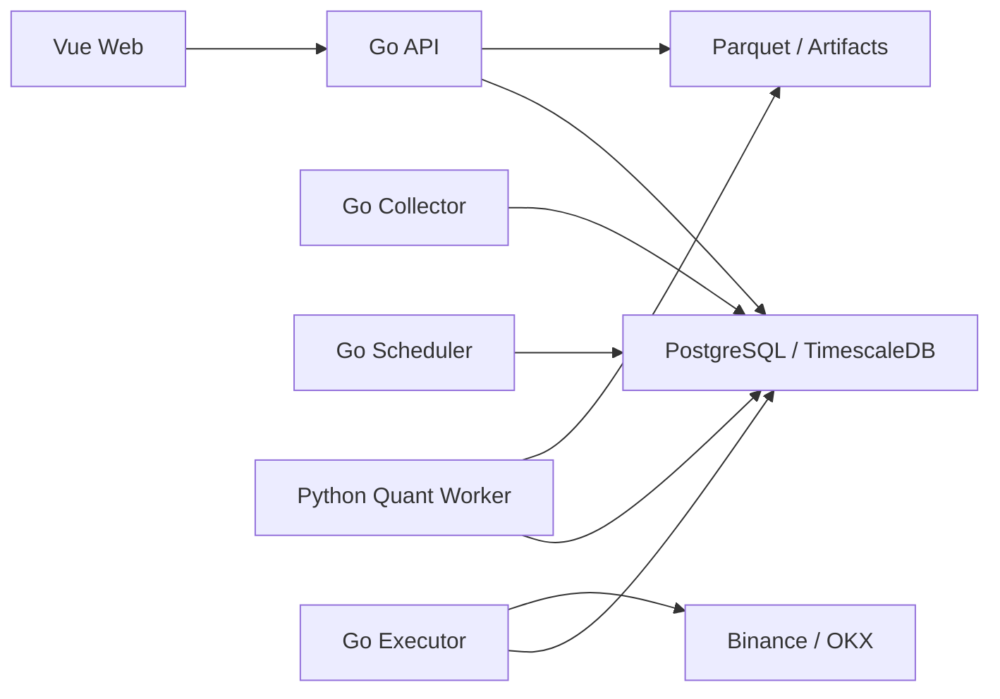

# 目标架构

## 原则

- 保持模块化单体，在明确出现独立扩缩容或故障隔离需求前不拆微服务。
- Go 平台拥有账户、风控、订单路由和审计；Python Worker 只运行数据集与回测任务。
- PostgreSQL 是业务事实源，Parquet 数据集不可变，工作流只传递资源 ID。
- 模拟与实盘共享代码契约，但账户、凭据、订单、仓位和风控状态强逻辑隔离。

## 运行拓扑

同一 Go 代码库最终构建 `api`、`collector`、`scheduler`、`executor` 四种进程。首版异步任务使用 PostgreSQL `FOR UPDATE SKIP LOCKED`，领域事件使用事务 Outbox，不引入额外消息中间件。

## 领域边界

- `marketdata`：交易所公共连接、品种、行情规范化、补数和数据质量。
- `dataset`：不可变 Manifest、Parquet 分区、校验和和引用保护。
- `news`：来源适配、去重、许可策略、实体与情绪标注。
- `strategy`：草稿、多文件策略包、不可变版本和参数 Schema。
- `backtest`：计算任务、双引擎适配、统一账本和统计指标。
- `trading`：账户、订单、成交、仓位、余额和交易所私有连接。
- `risk`：订单前检查、账户级限制、急停和风险事件。
- `workflow`：补数、批量回测、报告和通知等粗粒度编排。
- `platform`：认证、RBAC、配置、审计、可观测性和任务基础设施。
