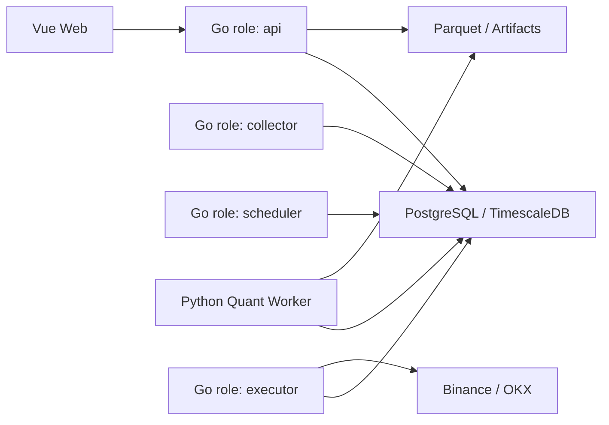

# 目标架构

## 原则

- 保持模块化单体，在出现可量化的独立扩缩容或故障隔离需求前不拆微服务。
- PostgreSQL/TimescaleDB 是在线事实源，Parquet 数据集不可变，工作流只传递任务类型、参数 Schema 和资源 ID。
- Go 平台拥有账户、风控、订单路由和审计；Python Worker 只执行数据集生成与回测计算。
- 模拟与实盘复用领域契约，但账户、凭据、订单、仓位和风控状态强逻辑隔离。
- 不为未来的第三种交易所、存储或通知渠道建设插件系统、消息中间件或兼容层。

## 当前 A1 基线

现有 Go 后台仍以单进程运行 HTTP/WebSocket、工作流和后台 Runtime；数据库 schema 由镜像内独立 migration 二进制演进。单一 PostgreSQL 基线包含当前业务表、Worker 队列、Outbox、外键、索引和状态约束，服务启动只读校验版本，不执行 DDL。Backend 与开发/CI Worker 共用 TimescaleDB，生产 Release 暂不部署 Worker。

异步任务使用 PostgreSQL `FOR UPDATE SKIP LOCKED`，领域事件使用事务 Outbox。任务与 Outbox 的租约、数据库时间 fencing、失败恢复和终态约束见[公共契约](../contracts/README.md)，数据库演进见 [ADR-0002](./decisions/0002-versioned-sql-migrations.md)。工作流版本分配、激活、停用和入口替换在 PostgreSQL 短事务内提交，其他连接只能观察完整旧快照或完整新快照。

进程通过唯一根 Context 传播取消并执行有界收尾。通知 WebSocket 已使用有限队列、单 writer、连续序号、RFC6455 Ping/Pong 和严格同源 Origin；当前鉴权仍使用查询串 Token，安全波次完成前不得把它写入代理、应用或测试日志。

## A2 起目标拓扑

A2 起，Go 常驻职责随实际能力落地到同一个应用二进制和镜像，通过 `COINSPHERE_ROLE=api|collector|scheduler|executor` 选择；不维护四套入口：

- `api`：HTTP/WebSocket、认证、管理接口和只读领域查询。
- `collector`：公共行情连接、补数和规范化写入。
- `scheduler`：粗粒度计划任务与领域任务投递。
- `executor`：模拟或实盘订单执行、恢复和对账；只有该角色可读取交易凭据。

Compose 和发布配置在角色实现后必须显式设置合法值。版本化 migration 继续作为发布步骤，不是第五种常驻角色；首版不引入 Redis、Kafka 或 NATS。

## Go 领域边界

新金融代码按实际能力放入 `backend/internal/<domain>`，不创建空目录或预留接口：

- `marketdata`：交易所公共连接、品种、行情规范化、补数和数据质量。
- `dataset`：不可变 Manifest、Parquet 分区、校验和与引用保护。
- `news`：来源采集、去重、许可策略和版本化因子。
- `strategy`：草稿、多文件策略包、不可变发布版本和参数 Schema。
- `backtest`：计算任务、双引擎适配、统一账本和统计指标。
- `trading`：账户、订单、成交、仓位、余额和交易所私有连接。
- `risk`：订单前检查、账户级限制、急停和风险事件。
- `workflow`：补数、数据集、批量回测、报告和通知等粗粒度编排。
- `platform`：认证、RBAC、配置、审计、可观测性和任务基础设施。

现有后台与工作流继续留在 `internal/service.App`，不做一次性全仓重构。A2 起新增的金融领域包不得依赖 `internal/api` 或 `internal/service`；API、角色启动层和工作流适配层从外向内调用领域能力。跨领域共享类型由拥有该概念的领域包定义，不建立无归属的 `common` 包。

## 接口与数据边界

- 新金融 HTTP 接口统一位于 `/api/v1`，请求和响应使用强类型 DTO；`map[string]any` 只保留在旧管理接口、动态工作流图和外部无类型载荷边界。
- 金融时间统一为 UTC；领域价格、金额、数量和费率使用 `shopspring/decimal`，数据库使用 `numeric(38,18)`，JSON 使用十进制字符串。
- 只有同一外部边界已经存在两个真实实现时才抽取接口。`MarketSource` 仅包含 Binance 与 OKX 已共同需要的能力；存储保持 PostgreSQL/TimescaleDB 具体实现，不增加单实现 Repository 接口。
- 工作流不得包含交易所协议、逐 K 线计算或下单逻辑；AI、工作流和通用 HTTP 节点不得调用交易所私有接口。

## 可读性约束

- 非平凡注释只解释设计目的、状态转换、并发/事务边界、失败处理和回滚语义。
- Go 语法、类型断言和框架入门说明集中在 [Go 入门笔记](../../backend/GO入门笔记.md)；修改旧代码时删除触及区域的教学式注释，不为清理注释单独做全仓重构。
- 仅当两个 Agent 会修改同一文件，或文件新增第二项独立职责时拆分文件；不按行数机械拆包。
