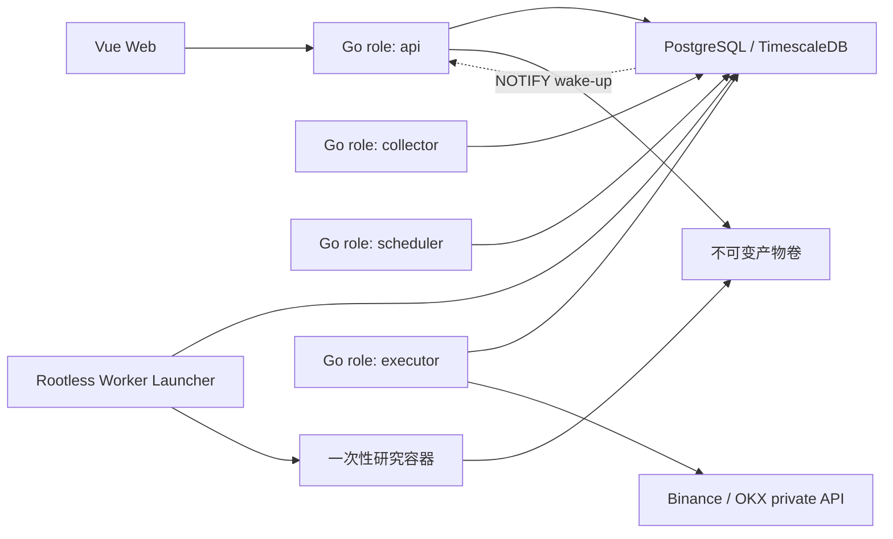

# 目标架构

## 原则

- 保持模块化单体和单应用镜像，在出现实测的独立扩缩容或故障隔离需求前不拆微服务。
- PostgreSQL/TimescaleDB 是在线事实源；不可变数据集和任务产物通过 Manifest 与内容哈希引用。
- Go 拥有行情规范、账户、订单、风控和权威账本；Python 只执行隔离的研究计算。
- 工作流只传递任务类型、参数 Schema 和资源 ID，不参与逐 K 线计算、交易所私有协议或下单。
- 不为未来交易所、存储、渠道或执行引擎建设动态插件平台、消息中间件或兼容层。

## 当前基线

本次重整以 `origin/main@69229e0` 为事实基线：该提交已包含 A0、A1 和 A2.0。Go 后台仍以单进程运行 HTTP/WebSocket、工作流和后台 Runtime；生产 Release 仍只部署 Backend/Web，尚未部署 Python Worker 或交易 Executor。

数据库由独立 migration 二进制演进，服务启动只读校验版本。现有 `00001` 建立 PostgreSQL 基线，`00002` 建立审计表，`00003` 建立三张普通行情表；A2.1 才处理 Timescale hypertable 和多角色运行。

通知 WebSocket 已使用有限队列、单 writer、连续序号、Ping/Pong、严格同源 Origin 和固定 `Sec-WebSocket-Protocol` 鉴权；查询串 Token 已被拒绝。生命周期、审计和健康检查见 [ADR-0003](./decisions/0003-a1-observability.md)。

## 目标拓扑

同一个 Go 二进制和镜像通过 `COINSPHERE_ROLE=api|collector|scheduler|executor` 显式选择职责，缺失或非法值拒绝启动：

- `api`：HTTP/WebSocket、认证、管理接口和领域查询，可无状态多实例。
- `collector`：公共行情连接、补数、规范化和质量事件，按数据流数据库租约分片。
- `scheduler`：工作流调度、图执行、任务投递和 Outbox；advisory lock 单活产生定时触发，行租约多活消费。
- `executor`：模拟或实盘订单执行、恢复和对账；按账户独占租约并使用 fencing，只有该角色可读取交易凭据。

A2 只常驻前三个角色，Executor 从 A6 开始部署。普通角色与 Worker 首期共用受限应用数据库身份，Executor 和 Migrator 独立；连接池按最大实例数计算部署总预算，不引入 PgBouncer。

通知记录先在数据库事务中持久化，`pg_notify` 只作唤醒提示。所有 API 实例监听同一频道并查询持久记录，只向自己持有的 WebSocket 连接推送；通知丢失或用户离线时由未读快照恢复。

## 领域边界

新金融能力按实际交付放入 `backend/internal/<domain>`，不创建空目录：

- `marketdata`：品种、公共连接、规范化、补数和数据质量。
- `dataset`：不可变数据集、Manifest、校验和和引用保护。
- `news`：来源、去重、许可和版本化因子。
- `strategy`：草稿、多文件策略包、发布版本和参数 Schema。
- `backtest`：研究任务、规范化订单/成交结果和统计。
- `trading`：realm、账户、权限、订单、成交、仓位、余额和复式账本。
- `risk`：账户硬限制、策略限制、急停和风险事件。

现有后台与工作流继续留在旧模块，按纵向能力迁移，不做一次性全仓重构。新金融领域不得依赖 `internal/api` 或 `internal/service`；当前通过 ADR、任务卡和最终只读复审检查，不引入额外架构测试框架。

## 数据、研究与交易边界

- `market_candles` 目标为 Timescale hypertable；具体周期、保留和质量口径见 [ADR-0005](./decisions/0005-market-data-lifecycle.md)。
- Worker 与不可变产物边界见 [ADR-0006](./decisions/0006-worker-and-artifacts.md)。
- 交易 realm、权限、账本和凭据边界见 [ADR-0007](./decisions/0007-trading-realm-and-ledger.md)。
- OpenAPI 和 `/api/v1` 迁移方式见 [ADR-0004](./decisions/0004-openapi-v1-governance.md)。

目标运行栈中的 Backend、Worker、数据库会话和金融事件统一 UTC。当前旧后台仍有依赖本地时区的路径，本治理 PR 不将其视为已完成；后续相关能力迁移时清理。用户计划保存 IANA 时区，触发时刻显式换算；前端只负责显示转换。金融 Decimal 使用 `numeric(38,18)` 持久化并以字符串输出 JSON。
