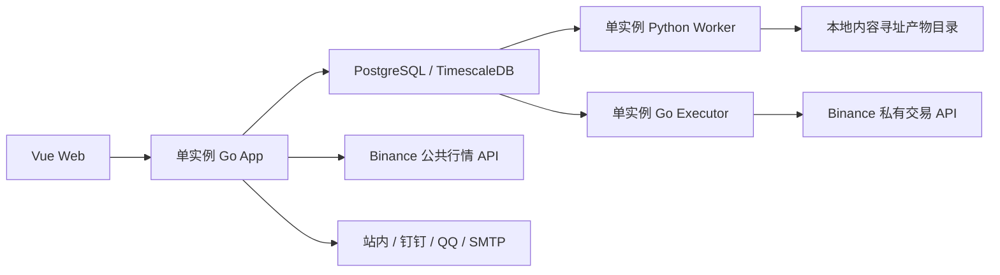

# CoinSphere 目标架构

## 产品边界

CoinSphere 是面向个人自托管和少量受邀用户的低频币圈量化平台。系统保留现有后台、RBAC 和工作流编辑器，新增 Binance 行情、单文件策略、回测、信号、人工确认、模拟盘和受控自动交易能力。

- 不开放注册；账号只由管理员创建。除登录页和登录接口外，所有业务页面和 API 均要求登录。
- 市场数据和管理员发布的策略版本是共享只读资源；自选、策略实例、回测、信号、交易账户、订单和通知按用户隔离。
- 首期只支持 Binance Spot 与 USD-M 永续、交易所原生周期、最低 `1m` 和闭合 K 线。
- 工作流只做粗粒度编排。量化模块发布领域事件，工作流可通知或访问允许的公网 HTTP，但不能调用交易所私有接口、创建交易命令或绕过风控。
- 实盘能力默认关闭；代码合并、部署和策略启用都不等于获得真实交易权限。

## 部署拓扑

生产默认运行在一台 Linux 主机的 Docker Compose 中。Web、App、Worker 和 Executor 均保持单实例；Executor 在 Paper 里程碑才加入部署，在此之前生产仍只运行已经交付的组件。

### Go App

Go App 合并 HTTP/WebSocket API、认证/RBAC、工作流 Runtime、调度、Binance 公共行情采集、信号协调和通知网关。不再通过 `COINSPHERE_ROLE` 拆分 API、Collector 和 Scheduler，也不为尚未交付的能力保留空壳角色。

Go App 可以访问 Binance 公共接口和已配置的通知渠道，但不得调用交易所私有接口。交易意图必须持久化到 PostgreSQL，并由 Executor 在重新校验权限和风控后处理。

### Python Worker

Worker 直接消费现有 PostgreSQL 任务队列，固定为两条执行通道：

- `realtime`：保留一个执行槽，只处理闭合 K 线触发的策略计算。
- `backtest`：保留一个受限执行槽，每个回测在独立子进程运行。

两条通道共享现有任务状态、租约、心跳、取消和崩溃恢复协议，但互不借用执行槽。Worker 服务可以容器化，不再为每个任务启动 Rootless Docker。策略只有管理员可以编辑，V1 视为可信代码；子进程只承担资源和故障隔离，不宣称提供恶意代码沙箱。

Worker 使用不含交易凭据的受限数据库身份。策略子进程使用清理后的环境、固定依赖、墙钟超时和 CPU/内存限制，不获得通知密钥、交易密钥或交易所私有网络能力。

### Go Executor

Executor 是唯一允许调用 Binance 私有接口的组件，同时处理 Paper、Testnet 和 Live 环境。它按账户串行处理交易意图，使用确定性的 `clientOrderId`，在订单状态未知时先按该 ID 对账，禁止无条件重试创建第二笔订单。

Executor 每次执行前重新检查全局急停、账户状态、策略授权、用户开关、风险上限、行情新鲜度和仓位归属。任何校验失败都只能生成阻断事件，不能产生外部订单。

Testnet 私有能力启用后，Executor 先验证凭据并读取账户、余额、仓位和开放订单，建立绑定当前凭据版本的只读投影。首次快照存在外部订单、既有敞口、双向持仓模式或非白名单抵押资产时保持暂停；只有无差异快照允许用户手工恢复账户，代码合并和对账成功都不自动放行交易。

账户手工恢复后，Testnet 主订单仍逐笔复验意图、行情、仓位归属、硬风控和授权。订单先持久化再提交；响应未知、进程中断或 HTTP 拒单都按确定性 `clientOrderId` 查询，只有权威查询确认不存在才允许重试。

活动 Testnet 账户持续轮询权威账户快照。Reconciler 只接受本地确定性订单能解释的开放订单和仓位；连续快照缺失本地活动订单时，仅对精确匹配 `pending`/`reconciling` 意图且严格符合主 `market` 调仓形状的订单创建带数据库 `recovered_at` 的本地投影，并暂停账户等待手工恢复，绝不修改外部订单。其余未知外部订单、未归属仓位、订单形状漂移、累计成交差异或查询未知都会暂停账户。在 `matched` 快照后，已管理成交订单的逐笔成交、手续费和 USD-M 资金费追加到独立的 `testnet_trade_facts` 事实表，并由交易所 ID 幂等去重。账户与凭据版本锁、订单更新时间栅栏和快照观察时间栅栏共同阻止旧结果覆盖新状态；持续对账不自动恢复账户。

Spot Live 复用确定性订单、保护单、权威对账和硬风控管线，但运行在独立的 `live` 环境范围。USD-M Live manual 复用同一管线但使用独立市场客户端，并在持续对账中要求逐仓、单向、账户配置的低杠杆、标记价和强平距离；USD-M Live auto 仍被禁止。manual 与 auto 均默认关闭；Spot auto 必须在 manual 已启用、账户已手工恢复后，同时具备管理员授权、Owner 自动交易放行、完整风控和匹配对账。执行器按环境、市场和 `mode` 隔离领取与恢复意图。每次暂停都会清除 Owner 的 manual/auto 放行并关闭自动化，保护单和紧急平仓仍可继续。当前只完成 Paper 与离线契约验证，不把它视为 Binance 环境晋级证据。

### PostgreSQL、TimescaleDB 与产物

PostgreSQL/TimescaleDB 是唯一在线数据库，同时承担轻量任务队列、领域 Outbox 和持久通知记录。不引入 Redis、Kafka、NATS、Consul、PgBouncer 或额外通知服务。

- `market_candles` 是唯一 K 线 hypertable，默认在线保留两年。
- 单实例行情采集不需要 PostgreSQL 流租约；`market_flow_leases` 与单流 Runner 已随 Binance 行情纵向能力删除。
- Outbox 和任务租约继续用于事务一致性、失败重试和崩溃恢复，不因单实例而删除。
- 普通回测只保存查询范围和规范化数据校验和；晋级候选把完整数据、策略、参数、运行时和结果冻结为规范化 `JSONL.gz`，并以 SHA-256 注册 Manifest。
- 冻结产物先使用本机内容寻址目录，不建设对象存储或多机复制协议；进入真实交易前按发布 Runbook 完成加密独立备份与恢复演练。

## 数据归属

| 资源                             | 可见范围             | 写入者                   |
| -------------------------------- | -------------------- | ------------------------ |
| Binance 品种、K 线               | 所有登录用户共享     | Go App                   |
| 策略草稿                         | 管理员               | 管理员                   |
| 已发布策略版本                   | 所有登录用户共享只读 | 管理员发布               |
| 自选、策略实例、回测、信号       | 资源所有者           | 所有者；策略代码除外     |
| 交易账户、风险、订单、仓位、凭据 | 资源所有者           | 所有者、Go App、Executor |
| 通知渠道和投递记录               | 资源所有者           | 所有者、Go App           |
| 工作流                           | 沿用现有 RBAC        | 现有工作流服务           |

管理员身份不会让普通资源接口自动跨用户查询。管理员创建用户、发布策略和审批自动化时使用独立管理接口；所有者过滤仍由应用查询和数据库归属约束执行。首期不引入 RLS。

## 关键数据流

### 行情与信号

1. Go App 同步 Binance Spot 和 USD-M 的全部品种元数据。
2. 历史 K 线按回测范围补齐；实时只订阅用户自选和已启用策略所需的数据流。
3. 闭合 K 线幂等落库并提交领域事件，随后创建 `realtime` 任务。
4. Worker 调用已发布策略版本并返回目标仓位；Go App 校验后持久化信号。
5. 正常负载下，从 Go App 收到闭合事件到信号持久化的 p99 目标不超过两秒。

### 策略与回测

策略版本固定一份 Python 文件、市场、品种、周期、回看窗口、参数 Schema 和运行时版本。Spot 输出 `0..1`、USD-M 输出 `-1..1` 的归一化目标仓位，表示相对于策略实例 `allocationUsdt` 的仓位比例。

回测与实时调用同一 `on_bar` 契约。每根闭合 K 线计算的新目标在下一根开盘成交；费用、滑点、资金费、止损和保守强平均使用 Decimal 计算。同一根 K 线无法确定先后顺序时采用对策略更不利的路径。

### 信号与执行

策略实例分别记录执行模式 `signal_only | manual | auto` 和环境 `paper | testnet | live`。手动信号在下一根 K 线闭合时过期；批准后按批准时的市场状态执行。自动模式必须同时存在管理员授权、用户启用和完整账户风控。

同一 `account + market + symbol` 最多一个 manual/auto 策略拥有活动仓位。风控触发或全局急停后禁止增仓，只允许减仓、平仓和撤单。

### 通知与工作流

通知继续使用现有渠道、投递记录、加密配置和 Outbox 机制。待批准信号、订单未知或失败、保护单失败、风控暂停和急停由 Go App 按固定规则投递；普通领域事件仍可触发工作流通知节点。

外部通知中的按钮只打开绑定用户和信号的一次性短期站内链接。链接本身不具备批准权限；用户必须登录，并在五分钟内完成密码复验后才能提交批准命令。Bot 回调和工作流节点永远不能直接下单。

## 明确不建设

- 多实例 API、Collector、Scheduler 或 Executor，以及为其服务的租约分片和通知中继。
- OKX、新闻/LLM 因子、高频、逐笔、盘口、跨所套利或复杂算法单。
- 动态策略插件、多文件策略、自定义依赖、自定义镜像或运行时安装依赖。
- 逐任务 Docker、Kubernetes、消息中间件、对象存储和独立通知网关服务。
- 通用复式账本、通用事件溯源平台或双回测引擎验证。
- 个人微信自动化；企业微信只在首轮通知渠道稳定且出现实际需求后增加。

这些能力只有在出现实际需求、现有方案达到可测量上限并新增 ADR 后才进入路线图。
