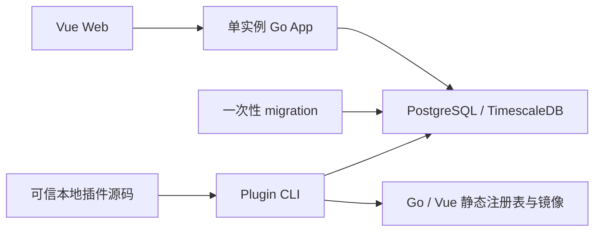
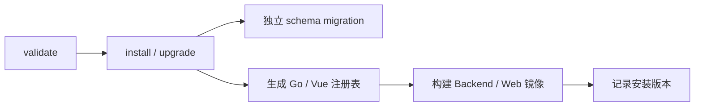

# CoinSphere 架构概览

## 当前边界

CoinSphere 正在重建为工作流优先、编译期插件驱动的个人自托管平台。V2 P0 和 P1 批处理工作室已完成；当前具备不可变修订、Schema 工作台、批次队列、检查点恢复、手工/UTC 定时触发、持久活动与内容寻址制品。事件流、Quant、回测和 Paper 仍按[路线图](../roadmap/README.md)继续开发。

- 只支持 PostgreSQL/TimescaleDB，领域时间统一使用 UTC。
- 价格、数量、金额和费率使用 Decimal；账务值禁止使用 `float64`。
- 不提供旧数据、旧接口、多数据库、Python Worker 或 Private Executor 兼容层。
- Testnet/Live 不属于当前阶段，任何部署都不会自动启用真实交易。

## 运行拓扑

默认 Compose 只运行 Web、Go App、一次性 migration 和 TimescaleDB。系统不依赖 Redis、消息代理、Kubernetes、动态插件进程或运行时目录扫描。

## 组件职责

### Vue Web

Web 提供登录、系统监控、用户、角色、菜单管理，以及超级管理员使用的 Schema 工作流工作台。前端插件入口由生成的 `frontend/src/plugins/registry.generated.ts` 静态导入；P0 的契约插件只用于自动化测试，不进入生产菜单。

### Go App

Go App 是单一后端进程，负责：

- Access Token 认证、RBAC、统一 Problem Details 和审计。
- 系统管理、健康检查、HTTP 指标与数据库就绪检查。
- 启动时加载编译进二进制的插件注册表。
- 暴露 SDK 的 Action、Trigger、作用域路由和结果页描述符契约。
- 向超级管理员提供节点 Schema 目录、工作流图校验、不可变修订、生命周期和批次操作。
- 从 PostgreSQL 有界队列领取固定修订批次，在 `stream`/`compute` 池执行核心或插件 Action，并原子保存 NodeRun、Checkpoint 和节点状态。
- 提供单调游标活动、批次完整节点路径和经过 SHA-256 校验的 gzip 制品下载，并按工作流保留期清理终态历史。

`running` 表示工作流允许手工或定时批次入队和领取；`pause` 不强制终止当前节点，节点完成后批次从检查点续跑。共享结果视图在 P4 交付。

### PostgreSQL / TimescaleDB

数据库当前保存认证、RBAC、菜单、i18n、审计、插件安装状态和引用，以及工作流、修订、密钥、运行实例、批次、NodeRun、Checkpoint、活动游标、制品清单和节点状态。修订、密钥绑定和未过期 Checkpoint 不可变；批次固定修订，过期租约由单实例执行器恢复。制品正文按 SHA-256 分片保存在 Backend 专用持久卷，数据库只保存受控元数据和引用。

应用启动只校验 migration 版本。核心 DDL 由一次性 migration 命令执行，插件 DDL 由生命周期 CLI 在维护窗口执行。

## 插件静态边界

插件是参与主 Go 进程和主 Vite 前端编译的完全可信本地源码，不是安全沙箱。

- `coinsphere-plugin.json` 固定插件 ID、SemVer、Core/SDK 约束、源码入口、migration 和贡献类型。
- SDK 注册 Action/Trigger、JSON Schema、作用域 API 和结果页；重复插件 ID、节点类型、路由或结果页会被拒绝。
- `WorkflowScope`、`ResultScope` 和 `SystemScope` 由核心注入，插件路由不得自行从查询参数恢复授权范围。
- 安装或升级失败会恢复源码输入、生成文件和已执行的插件 migration；命令不启动候选镜像。
- 卸载在有活动引用时拒绝并保留插件 schema；`purge-data` 仅在已卸载、无任何引用且确认文本匹配时删除数据。
- 同一 checkout 的维护命令当前要求串行执行；出现多维护端并发需求时再增加跨进程锁。

## 安全边界

- 匿名 HTTP 入口只有登录、健康检查和静态资源；其他已注册 API 要求登录及对应权限。
- 插件仅接受本地可信源码；项目不下载插件、不校验远程签名、不热加载共享库。
- 日志不得记录密钥、令牌、DSN、原始载荷或个人数据。
- AI、工作流和通用 HTTP 节点不得调用交易所私有接口或绕过风控。
- 真实交易所凭据不得进入代码、测试、CI、Issue、PR 或 AI 上下文。

目标架构见[工作流平台 V2](workflow-platform-v2.md)，当前决策见 [ADR-0002](decisions/0002-compile-time-plugin-workflow-platform.md)，接口语义见[公共契约](../contracts/README.md)。
