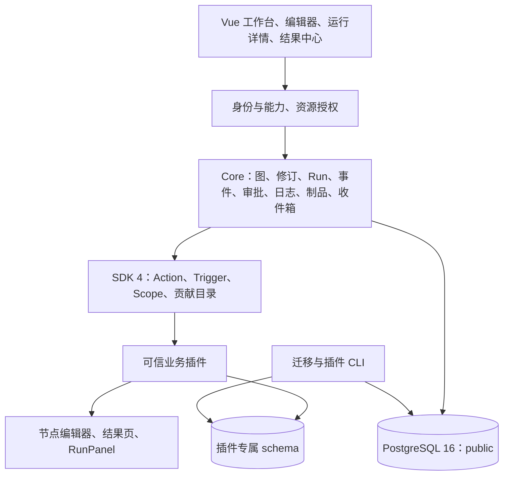

# CoinSphere 当前架构

CoinSphere 是以工作流为核心、以可信插件扩展业务的通用自托管系统。Go/Vue 模块化单体与 PostgreSQL 16 保持不变；Core 4、SDK 4 和 Graph 3 建立通用边界。最终决策见 [ADR 0006](decisions/0006-general-workflow-platform.md)，字段语义见[公共契约](../contracts/README.md)。

## 模块与数据所有权

```mermaid
flowchart TB
    Web[Vue 工作台、编辑器、运行详情、结果中心] --> API[身份与能力、资源授权]
    API --> Core[Core：图、修订、Run、事件、审批、日志、制品、收件箱]
    Core --> SDK[SDK 4：Action、Trigger、Scope、贡献目录]
    SDK --> Business[可信业务插件]
    Core --> PG[(PostgreSQL 16：public)]
    Business --> Domain[(插件专属 schema)]
    Business --> Frontend[节点编辑器、结果页、RunPanel]
    CLI[迁移与插件 CLI] --> PG
    CLI --> Domain
```

| 所有者 | 职责与事实 |
| --- | --- |
| Core | 用户、角色能力、菜单导航、会话撤销；工作流 owner/grants、不可变修订、draft/published 指针；队列、租约、检查点、人工任务、日志、内容寻址制品；通用站内收件箱与 ResultView |
| 插件 | 领域计算、私有数据、外部协议、领域清理、入站协议、结果动作和 UI；在 Core 注入的 Scope 中处理资源 |
| Quant | 策略、指标、信号、回测与逐帧图执行；金融契约位于 plugin/contracts/trading |
| Binance | 公共行情、品种、Paper 账本与交易所私有协议；Live 默认关闭，沿用独立风控门禁 |
| Notification | 通知内容组合及外部投递审计；站内消息通过 Host.Inbox 提交给 Core |
| Vue | 直接使用原生 Workflow/Revision/Run 和 Graph 3；前端路由与按钮反映有效权限，服务端承担最终授权 |

Core 不按业务表名清理插件数据。插件 Cleanup 在 Core 的删除事务中执行；领域外键和约束仍由插件维护。插件 Ingress 将已验证的请求转换为 CloudEvent，Core 负责事件去重和持久投递。无需 Quant/Binance 即可使用手动、定时、事件、Connector、AI 与通知。

## 定义、发布与执行

创建把工作流元数据、初始图、凭据绑定和运行配置一次性提交。保存生成不可变修订并更新 draftRevisionId，可原子保存元数据；不会切换 publishedRevisionId。发布显式选择已校验的修订，复验 owner 的运行能力、插件执行能力和必要凭据。自动触发只使用发布修订；手工运行锁定请求指定修订和入口。

图使用节点命名空间输出，不合并同名字段。入口 input、nodes、event 和实际 incoming 边独立存在；ready、entered、triggered 等字段没有 Core 隐含语义。Loop 使用独立子图与展开节点 ID，插件可声明配置内 ID 的重写函数。

PostgreSQL 是唯一执行事实源。进程先占用有界 Run 预算，再领取队列；默认最多 16 个 Run 执行者、4 个 stream 节点和 1 个 compute 节点。Loop 与审批编排不占用子节点槽。Loop 超时从最早父节点 attempt 开始计时，重试不重置绝对期限。

Run 租约为 30 秒，每 10 秒续租，每 5 秒扫描过期 Run。续租数据库错误、零行更新或授权失效取消旧执行者；执行事实写入须持有当前未过期租约。已开始且不具备安全重试语义的外部调用，恢复为 unknown_result 并等待人工处理，不盲目重发。

含持久状态的图在整个工作流范围串行；状态按 workflow/revision/node 隔离，状态与成功检查点在同一租约保护事务提交。发布新修订不复用旧修订状态。

审批任务的创建与 Run/RunNode waiting 在同一事务完成；决定、过期、替代和取消使用相同锁顺序。待办提交前不可见，并发决定只成功一次，恢复仍从检查点继续。诊断重放复用副作用节点的原检查点；缺少检查点明确失败。

## 权限与插件贡献

角色能力从 permissions/role_permissions 计算，菜单仅作为导航。工作流请求同时要求能力和 owner 或 user/role grant；owner 仍需角色能力。授予角色、能力或资源范围不能超过操作者当前权限，受保护权限与管理员有独立限制；修改与审计在事务内提交并复验授权。

SystemScope 携带当前用户可访问的工作流范围，插件查询必须应用它；WorkflowScope 锁定 workflow/revision/node/plugin；ResultScope 锁定视图、资源、过滤和动作，调用方不能替换用户身份。固定节点视图不能升级为整个 Run 的取消、重试或工作流暂停权限。登出撤销写入数据库；长连接定期复验身份、令牌和权限。

插件是同进程可信源码，不是安全沙箱。安装、编译、加载分别展示；只有安装版本与编译版本精确一致才加载。注册表拒绝依赖缺失、贡献冲突、未声明权限与错误 Schema。普通页面、固定结果页和运行面板使用不同贡献键，按明确 pluginId 加载。

当前 draft/published 修订、未终结 Run 和未撤销 ResultView 在各自事务维护 plugin_references；生命周期与建立引用锁定同一安装行。活动引用阻止升级或卸载。历史引用保留，卸载不删除数据；purge-data 要求全部引用解除和显式确认。

## 启动、迁移与部署

应用启动只验证 generation 4、PostgreSQL 16 和 Core/已编译插件 migration，不执行 DDL。随后加载插件、初始化能力与导航、启动队列及 HTTP；关闭时停止领取并协作取消执行者。

新系统使用独立 Core 与官方插件基线。旧 00001–00023 文件保留且不改写，正常 Up 拒绝旧 schema_migrations。一次性 workflow-migrate 将旧工作流当前定义和必要配置导入独立空目标库，所有定义及视图保持 inactive；不迁运行、事件、状态、待办或 Live 放行。

生产仍为一个内置 Vue 产物的 Go App，连接服务器 PostgreSQL 16，并保存独占制品/上传目录。跨 generation 使用维护窗口、隔离目标、源/目标指纹及匹配数据库/镜像/配置恢复点，操作见[数据库迁移手册](../runbooks/database-migrations.md)。应用回滚不执行 Down。

验证默认交远端 CI。现有测试证明合成场景中的事务、恢复、权限、迁移和关键页面行为；生产工作流盘点、秘密重绑、外部插件映射和现场恢复演练由迁移执行环境提供证据。
