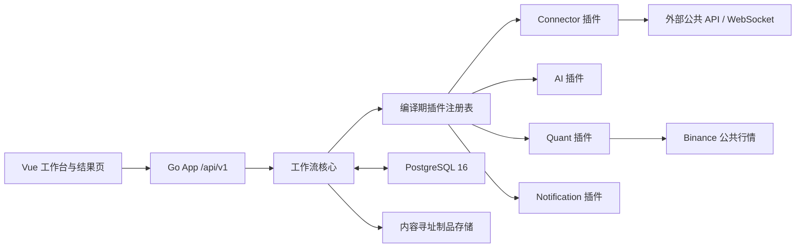
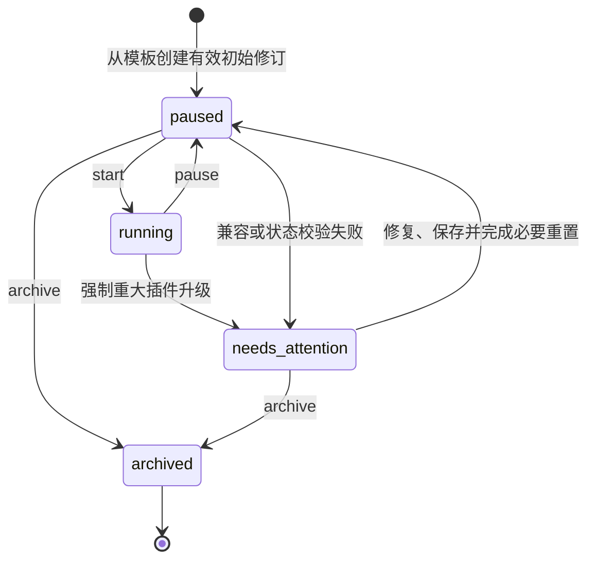
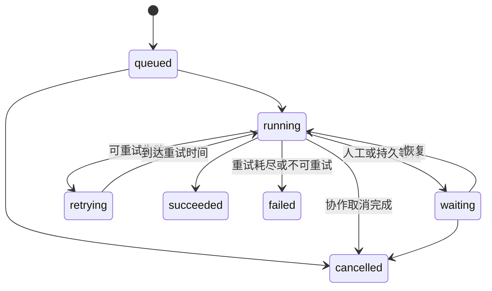
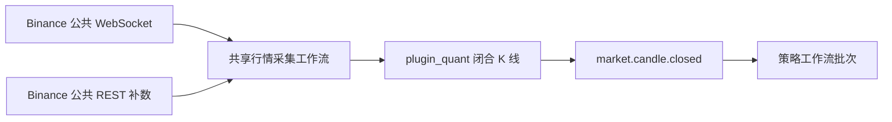
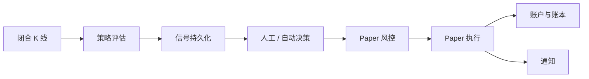

# CoinSphere 工作流平台 V2 目标设计

- 状态：实施中（In Progress）
- 日期：2026-08-24
- 适用版本：V2 目标态
- 关联决策：[ADR-0002：编译期插件驱动的工作流平台](decisions/0002-compile-time-plugin-workflow-platform.md)、[ADR-0003：复用服务器 PostgreSQL](decisions/0003-use-shared-postgresql.md)
- 交付顺序：[V2 开发路线图](../roadmap/README.md)

> 本文描述 V2 目标架构。P0 基线与插件 SDK 已完成，其余代码、接口和操作仍以[架构概览](overview.md)、[公共契约](../contracts/README.md)和[使用手册](../user-guide.md)为准。各阶段达到退出条件后，再把对应契约和用户文档切换为已实现状态。

## 1. 目标与边界

CoinSphere V2 是以可视化工作流为核心的通用自动化平台。工作流负责配置、触发、运行、观察、历史和故障处理；数据采集、策略、AI、通知等业务能力由采用统一契约的插件提供。首个完整验收场景仍是 Binance Spot/USD-M 公共行情、策略回测、信号审批、Paper 执行和通知。

### 1.1 设计目标

- 用户在一个工作台内创建、连接、配置、启动、暂停、观察和排障，不需要理解 `entryKey`、原始运行输入或内部版本入口。
- 一个节点既声明配置界面，也声明输入、输出、执行语义和结果展示，使工作流核心不包含量化、AI 或通知的私有协议。
- 持续运行的工作流仍由有界、可重放的事件批次组成，任何失败都能定位到固定修订、固定输入和具体节点。
- PostgreSQL 16 是唯一持久事实源；单实例部署在目标容量内保持简单、可恢复和可运维。
- 策略实时评估和回测复用同一份 Go 实现；所有金融时间使用 UTC，所有价格、数量、金额和费率使用 Decimal。
- 新交易能力默认关闭。V2 只实现 Paper，真实交易和交易所私有接口不在本设计范围内。

### 1.2 保留、替换与延期

| 类别 | 内容                                                                                                                              |
| ---- | --------------------------------------------------------------------------------------------------------------------------------- |
| 保留 | Vue 3/Vite/Element Plus/X6、Go App、PostgreSQL 16、认证、用户、角色、菜单、现有 RBAC、系统监控首页、模块化单体           |
| 重建 | 工作流定义与运行模型、工作台、节点契约、事件队列、结果页、Paper 业务链路和迁移基线                                                |
| 移除 | Python Worker、双槽位任务协议、新闻领域、全局策略源码编辑、Testnet/Live、Private Executor、被节点本地配置取代的全局模型和通知资源 |
| 延期 | 插件签名、市场、热加载、沙箱、独立插件宿主、多实例集群、消息代理、任意在线代码执行、真实交易                                      |

V2 按全新系统建设，不增加旧数据、旧 API、多数据库或旧工作流图的兼容层。开发数据允许在 P0 重置；任何重置都不得触及已经进入正式 Paper 观察的数据库。

## 2. 用户体验与信息架构

### 2.1 角色和可见范围

| 用户       | 首页             | 工作流                                               | 结果页                     | 管理功能                             |
| ---------- | ---------------- | ---------------------------------------------------- | -------------------------- | ------------------------------------ |
| 超级管理员 | 系统与工作流健康 | 创建、编辑、保存、启动、暂停、归档、重试、取消、重放 | 全部管理视图和已共享视图   | 用户、角色、菜单、插件状态、系统设置 |
| 普通用户   | 系统监控摘要     | 不显示菜单、路由和 API 资源                          | 仅显示被授权的结果视图实例 | 仅保留现有 RBAC 授予的非工作流能力   |

首期不把工作流权限下放给普通角色。RBAC 数据模型继续保留细粒度权限，以便后续放开，而不是另建一套授权系统。

### 2.2 工作台

桌面端工作台保持一个稳定布局：

- 左侧是可搜索、可按状态过滤的工作流列表和场景模板入口。
- 中央是 X6 画布，边同时表达控制流和数据到达；运行时在原图上显示节点状态、耗时和最近流量。
- 右侧检查器根据节点 JSON Schema 和 UI Schema 生成表单，并提供上游字段映射、密钥配置和高级 CEL 表达式。
- 底部活动时间线显示当前运行实例的健康、最近事件、批次、人工任务和结构化错误，可展开到单批次完整路径。
- 顶部只暴露明确命令：保存、启动、暂停、归档，以及运行模式和当前修订。版本号、内部入口和原始 JSON 放入只读诊断信息，不作为日常配置项。

创建工作流时先选择场景模板。官方首批模板为共享行情采集、策略回测、Paper 策略和故障通知；“空白高级工作流”仍创建一份可校验的最小图，由一个手工触发器连接结束节点。

移动端提供系统监控、结果页、审批和批次详情，不提供画布编辑。移动端进入编辑 URL 时转到该工作流的只读活动视图。普通用户不会看到源工作流名称、ID、拓扑或跳转入口。

### 2.3 结果页

插件可以贡献面向管理员的完整结果页，例如行情、回测、信号、Paper 账户和通知投递。结果页不是工作流配置的替代入口，但可以提供与结果直接相关的操作，例如信号审批、拒绝、任务重试、取消、暂停和导出。

管理员可以从插件结果页创建共享结果视图实例。实例固定以下内容：

- `pluginId` 与 `pageKey`；
- 由插件 Schema 校验的不可变范围和过滤器；
- 允许执行的操作白名单；
- 获授权的用户或角色；
- `active` 或 `revoked` 状态。

范围或过滤器不能原地修改；需要变化时创建新实例并撤销旧实例，从而保留审计语义。结果 API 从已认证的视图实例解析范围，忽略或拒绝客户端提交的工作流范围。插件返回给普通用户的数据不得包含源工作流标识。

## 3. 总体架构



生产 Compose 只部署 Web 和 Go App，一次性 migration 连接服务器现有 PostgreSQL 16 的独立 `coinsphere_go` 数据库。插件被编译进 Go App 和主 Vite 前端，不增加常驻插件进程。P0 移除 Python Worker 服务、Worker 卷和 Private Executor profile。

### 3.1 模块职责

| 模块       | 拥有的状态与职责                                                       | 不负责                               |
| ---------- | ---------------------------------------------------------------------- | ------------------------------------ |
| Web        | 工作台交互、Schema 表单、活动视图、插件结果组件、RBAC 路由             | 业务幂等、密钥保存、运行调度         |
| API/RBAC   | 认证、权限、结果范围解析、请求校验、审计                               | 插件领域计算、逐事件编排             |
| 工作流核心 | 图校验、修订、生命周期、事件入队、批次、检查点、重试、人工等待、活动流 | Binance 私有协议、策略公式、通知协议 |
| 插件运行时 | 描述符注册、受限上下文注入、节点执行、插件路由和结果页注册             | 动态装载、进程隔离、签名验证         |
| PostgreSQL | 核心事实、持久队列、Outbox、幂等键、插件 schema、运行历史              | 进程内临时 UI 状态                   |
| 制品存储   | 压缩的大输出、回测明细、SHA-256 清单                                   | 可查询业务索引、密钥                 |

工作流和插件保持同一进程内的模块边界。工作流核心只调用 SDK 契约；插件只通过注入服务访问正常范围。插件源码属于完全信任代码，技术上可以绕过这些约束，此限制必须在安装命令和运维文档中明确显示。

## 4. 工作流领域模型

### 4.1 核心实体

| 实体               | 关键字段                                            | 不变量                                   |
| ------------------ | --------------------------------------------------- | ---------------------------------------- |
| `Workflow`         | ID、名称、模式、状态、活动修订 ID、主触发器、保留期 | 一个主触发器、一个运行实例；归档后只读   |
| `WorkflowRevision` | 修订号、不可变图、节点类型版本、创建者、创建时间    | 保存后不更新；批次始终固定一个修订       |
| `WorkflowRuntime`  | workflow ID、活动游标、健康摘要、并发和背压状态     | 与 Workflow 一对一，不保存第二套期望状态 |
| `EventRecord`      | CloudEvent、分区键、入队时间、投递状态              | `(source,id)` 唯一；先持久化后投递       |
| `ExecutionBatch`   | 事件、修订、状态、分区、诊断标记、关联批次          | 有界、可重放；终态不可改写               |
| `NodeRun`          | 批次、nodeInstanceId、尝试号、状态、操作键、耗时    | 同一尝试只有一个终态                     |
| `Checkpoint`       | 节点输出摘要、完整输出引用、完成时间                | 成功节点提交后原子可见                   |
| `HumanTask`        | 类型、业务键、状态、过期时间、决定者                | 决定只提交一次；可被新业务动作取代       |
| `Artifact`         | SHA-256、压缩格式、大小、存储位置、引用             | 内容寻址；日志不内嵌大内容               |
| `ResultView`       | 插件页面、固定范围、操作白名单、授权、状态          | 普通用户无法扩大范围或发现源工作流       |

插件领域数据位于插件自有 schema，例如 `plugin_quant`。核心表只保存跨插件运行事实和引用，不复制插件账本、行情或结果数据。

### 4.2 工作流状态机



- `start` 只在存在完整有效的活动修订、所需密钥和状态均可用时成功。
- `pause` 停止调度、断开长连接触发器并停止领取新批次；当前节点完成或失败后保存检查点，已持久化事件和批次保留到恢复。
- `archive` 只能从 `paused` 或 `needs_attention` 执行。归档不删除修订、历史、制品、插件数据或审计记录。
- 重大插件升级不会自动恢复工作流。管理员必须检查新节点配置、处理状态重置、保存新修订，然后显式启动。

### 4.3 批次和人工任务状态



节点取消通过 `context.Context` 协作完成。取消请求发出后不再调度后续节点，当前 Go 处理器返回时批次进入 `cancelled`。无法响应取消的可信插件不能在主进程内被强制终止；出现实际隔离需求后再引入独立 Go Worker。

人工任务使用 `pending/approved/rejected/expired/superseded`。进入等待后，核心保存上下文并释放执行池和分区占用；恢复结果作为节点的类型化输出继续执行。新信号可以按节点配置的业务键把旧 `pending` 任务置为 `superseded`，旧批次随后以“已取代”结果继续，而不是作为系统失败处理。

### 4.4 运行模式

| 模式     | 主触发器              | 典型用途            | 批次边界             |
| -------- | --------------------- | ------------------- | -------------------- |
| `batch`  | 手工、定时、Webhook   | 补数、回测、导出    | 一次触发一个批次     |
| `event`  | CloudEvent 订阅       | K 线收盘、失败处理  | 一个事件一个批次     |
| `stream` | 长运行 TriggerHandler | WebSocket、持续采集 | 每次 `Emit` 一个批次 |

每个图只能有一个主触发器。子流程调用创建独立子批次并固定调用时解析到的修订；父批次等待子批次的类型化结果。持续流“正在运行”表示触发器和运行实例健康，不表示存在无限节点调用栈。

### 4.5 修订和保存

编辑中的画布状态保留在前端，离开存在未保存修改的页面时提示确认。显式保存按以下顺序执行，任一步失败都不创建修订或切换活动指针：

1. 校验恰好一个主触发器、节点和边引用、端口方向以及不可达节点。
2. 禁止图级环路；Loop 必须是拥有内嵌子图的结构化节点，并配置正数 `maxIterations`、绝对超时和退出条件。
3. 按 JSON Schema 2020-12 校验节点配置、输入和输出，确认字段映射的来源节点在拓扑上游且类型兼容。
4. 编译 CEL，并拒绝对 Decimal 标记字段执行 CEL 算术。
5. 校验插件版本、节点类型版本、所需密钥槽和状态兼容性。
6. 在一个数据库事务内写入不可变修订、密钥绑定和状态变更，再原子切换 `active_revision_id`。

运行中的批次继续使用创建时的修订和密钥绑定；后续事件使用新修订。保存失败或事务回滚时，旧修订和运行实例不受影响。

### 4.6 配置、映射、密钥和状态

节点的 `configSchema`、`inputSchema` 和 `outputSchema` 使用 JSON Schema 2020-12；`uiSchema` 独立声明分组、控件、顺序、条件显示和布局。默认表单由 Schema 生成，只有复杂交互才注册自定义 Vue 组件。

每个节点实例独立保存普通配置和密钥槽，不引用全局连接、模型、账户或通知渠道资源。即使多个节点使用相同服务，也允许重复配置；只有出现已实现的共享生命周期需求时，才由对应插件提供显式的共享节点或平台级工作流。

仅允许少量平台扩展：

- `x-coinsphere-secret`：值由独立密钥槽提供；
- `x-coinsphere-decimal`：字符串承载的 Decimal，不允许进入 CEL 浮点算术；
- `x-coinsphere-field-source`：允许从上游字段映射。

输入绑定不再使用共享字符串路径，而是保存结构化值：

```json
{
  "symbol": {
    "kind": "field",
    "nodeInstanceId": "market-source",
    "fieldPath": ["instrument", "symbol"]
  },
  "threshold": {
    "kind": "literal",
    "value": "0.05"
  },
  "label": {
    "kind": "cel",
    "expression": "event.type + ':' + input.symbol"
  }
}
```

CEL 类型环境由事件、工作流输入和上游输出 Schema 生成。Decimal 字段可以映射、比较是否存在或传入类型化节点，但价格、数量、金额和费率计算必须使用 Go 节点中的 `shopspring/decimal`。

密钥值复用现有应用密钥加密机制，存入与修订 JSON 分离的版本化密钥表，键由修订、`nodeInstanceId` 和字段组成。处理器通过注入的 `SecretReader` 获取值；序列化节点配置时只返回“已配置”状态。复制节点或工作流会生成新 `nodeInstanceId`，只复制普通配置，不复制密钥绑定或状态。

状态存储以插件、工作流和 `nodeInstanceId` 命名空间隔离。节点描述符声明无状态或有状态，并提供配置兼容性检查。兼容修改沿用状态；破坏性修改要求工作流暂停、插件领域校验通过、管理员显式确认重置，且重置写入审计。

## 5. 执行与事件语义

### 5.1 事件信封

所有核心和插件事件使用 CloudEvents 1.0 JSON。`partitionkey` 是 CoinSphere 扩展属性；量化 K 线固定使用市场、品种和周期组成的键。

```json
{
  "specversion": "1.0",
  "id": "01K4...",
  "source": "urn:coinsphere:plugin:official.quant",
  "type": "market.candle.closed",
  "subject": "binance:spot:BTCUSDT:1m",
  "time": "2026-08-24T08:00:00Z",
  "datacontenttype": "application/json",
  "partitionkey": "binance:spot:BTCUSDT:1m",
  "correlationid": "01K4...",
  "causationid": "01K4...",
  "data": {}
}
```

`(source,id)` 在事件表中唯一。事件只有在事务提交后才对调度器可见；Outbox 用于把同一事务内产生的领域事实转换成事件。投递是至少一次，消费节点不得依赖“只调用一次”。

### 5.2 队列、顺序和背压

- PostgreSQL 持久队列按工作流、主触发器和分区维护投递记录；同一分区任一时刻最多有一个非等待批次推进，不同分区可以并发。
- 人工或持久等待保存检查点后释放分区，因此后续同分区事件可以继续并产生取代动作；恢复仍使用原批次修订。
- 每个工作流有有界并发和积压上限，全局执行器只有 `stream` 与 `compute` 两个池。`compute` 默认并发为 1。
- 达到背压阈值时停止领取新事件，并让可暂停的 TriggerHandler 等待。Binance 流在断线或暂停后通过 REST 缺口补数恢复，不依赖无限内存缓冲。
- 单实例故障不会丢失已提交事件。重启后租约超时的批次重新进入可领取状态，并从最后成功检查点继续。

### 5.3 检查点、重试和幂等

每次节点运行获得稳定操作键：

```text
sha256(batchId + ":" + nodeInstanceId + ":" + loopIteration)
```

成功输出、制品引用和节点状态在同一事务内提交为检查点。后续失败只重试失败节点，不重新运行已成功节点。节点级重试策略声明最大次数、退避和可重试错误类别；耗尽后批次进入 `failed`，核心发布 `io.coinsphere.workflow.batch.failed` CloudEvent。

预期业务分支使用类型化输出和条件节点；系统失败不要求每个节点提供错误端口。默认故障处理方式是单独订阅标准失败事件的工作流。

通知、Paper 账本和其他副作用必须以操作键建立唯一约束。若进程在外部调用后、检查点前退出，重试使用同一操作键查询或复用结果，不能产生第二笔业务操作。

### 5.4 重放和实时观察

诊断重放创建关联原批次的新批次，固定原事件、原修订和原始制品。节点描述符按 `none/notification/human_action/paper` 标记副作用；后三类在诊断重放中不执行真实副作用，而返回清楚标记的模拟结果。诊断重放不能成为补发通知或重做 Paper 成交的入口。

工作台先通过游标分页 API 读取持久活动，再用 WebSocket 接收增量。每条消息包含单调活动游标；断线重连携带最后游标，服务端从持久记录补齐后再切换实时流。WebSocket 只负责低延迟展示，不作为事实源。

### 5.5 保留、制品和容量

- 工作流批次、节点运行和结构化日志默认保留 30 天，管理员可按工作流调整；审计和插件金融事实遵循各自更长的领域策略。
- 日志只保存小型输出、摘要、大小和 SHA-256。大型 JSON、回测明细等使用标准库压缩并按 SHA-256 内容寻址，清单记录格式、大小和引用。
- 状态拥有模块只记录一次结构化事件；日志不得包含密钥、令牌、原始外部载荷或个人数据。
- 目标容量为约 20 个运行工作流、100 个活动分区和持续 10 个事件/秒。基准突发为 50 个事件/秒持续 60 秒，要求 5 分钟内无丢失地清空积压，且无重复业务副作用。
- 允许插件安装、重大升级和 schema 迁移造成分钟级维护停机；不为无停机部署增加第二实例协调层。

## 6. 编译期插件模型

### 6.1 来源和目录

插件只从超级管理员明确指定的本地源码目录全局安装。所有获授权的工作流编辑者看到同一组已安装能力。插件可以贡献 Action 节点、长运行 Trigger 节点、API 路由、节点配置组件、结果页和 PostgreSQL migration；不能贡献常驻独立进程。

```text
plugin-root/
  coinsphere-plugin.json
  backend/
  frontend/
  migrations/
```

`coinsphere-plugin.json` 使用 JSON，避免为插件清单引入新的解析协议。最小清单如下：

```json
{
  "schemaVersion": 1,
  "id": "official.quant",
  "name": "CoinSphere Quant",
  "version": "1.0.0",
  "sdkMajor": 1,
  "requiresCore": ">=2.0.0 <3.0.0",
  "backend": {
    "module": "coinsphere/plugin-quant",
    "package": "./backend"
  },
  "frontend": {
    "entry": "./frontend/index.ts"
  },
  "migrations": {
    "directory": "./migrations"
  },
  "contributes": ["nodes", "triggers", "apiRoutes", "pages", "resultPages", "migrations"]
}
```

`id` 使用稳定的小写点分名称；`version` 和 `requiresCore` 使用 SemVer。源码安装会复制或登记本地目录、生成 Go/Vue 静态注册表、更新依赖和 migration 索引，然后重建 Compose。应用启动时只加载编译进二进制的注册表，不扫描目录或动态加载共享库。

### 6.2 SDK 契约

P0 固定以下公开概念；实际 Go 包名由 SDK 模块统一提供，插件不得自行复制同名结构：

```go
type NodeDescriptor struct {
    Type          string
    Version       string
    Kind          NodeKind
    ConfigSchema  json.RawMessage
    UISchema      json.RawMessage
    InputSchema   json.RawMessage
    OutputSchema  json.RawMessage
    Pool          ExecutionPool
    SideEffect    SideEffectClass
    State         StateMode
}

type ActionHandler interface {
    Execute(context.Context, ActionRequest) (ActionResult, error)
}

type TriggerHandler interface {
    Run(context.Context, TriggerRequest, Emitter) error
}
```

`ActionRequest` 提供固定修订、`nodeInstanceId`、操作键、已解析输入、普通配置、`SecretReader`、命名空间状态存储、制品存储和结构化日志器。`ActionResult` 只包含与 `outputSchema` 一致的输出和制品引用。`Emitter` 接收 CloudEvent 并在数据库提交后返回；TriggerHandler 必须响应取消和背压。

插件通过一个生成的注册函数登记描述符、处理器、结果页和路由。核心控制节点由工作流核心拥有；官方量化节点也使用同一注册方式，不使用私有旁路。

### 6.3 路由和结果页作用域

`PageDescriptor` 声明独立页面的 `pageKey`、标题、图标和缓存设置，由核心生成顶级菜单。`ResultPageDescriptor` 只声明限定工作流上下文的结果渲染器。插件 API 路由注册时必须选择以下一种注入上下文：

- `WorkflowScope`：仅超级管理员工作流页面使用，包含当前工作流和节点范围；
- `ResultScope`：共享结果页使用，只包含视图 ID、插件、页面、服务端固定作用域/过滤器、操作白名单和当前用户；
- `SystemScope`：仅插件安装状态和系统级健康检查使用。

共享结果路由不能从查询参数读取工作流范围。核心在进入插件处理器前完成认证、视图状态、授权和操作白名单校验。完全信任插件仍可直接访问进程或数据库，因此作用域是正常开发契约，不是安全沙箱。

### 6.4 CLI、版本和迁移

| 命令                                 | 行为                                                                                |
| ------------------------------------ | ----------------------------------------------------------------------------------- |
| `plugin validate <dir>`              | 校验清单、SemVer、Core/SDK 兼容、目录、Schema、迁移命名和注册冲突，不修改仓库       |
| `plugin install <dir>`               | 安装本地源码，生成注册表，更新依赖与迁移索引，重建 Compose                          |
| `plugin upgrade <dir>`               | 执行兼容升级；重大版本默认拒绝                                                      |
| `plugin upgrade <dir> --force-major` | 暂停所有引用工作流并标记 `needs_attention`，升级但不自动恢复                        |
| `plugin uninstall <id>`              | 有活动工作流、修订或结果视图引用时拒绝并列出引用；成功后移除代码和注册，保留 schema |
| `plugin purge-data <id>`             | 仅在插件已卸载且无引用时显式删除插件 schema；要求交互确认和备份提示                 |

插件拥有 `plugin_<short_id>` schema 和独立 migration 序列，核心维护已安装插件及迁移账本。小版本和补丁版本必须保持现有节点配置、输入输出和状态向后兼容。重大升级可以要求新修订或状态重置，但不得偷偷转换并自动启动工作流。卸载不运行 Down migration；数据删除与代码卸载是两个操作。

### 6.5 官方插件

| 插件         | 首期能力                                                        | 明确边界                                              |
| ------------ | --------------------------------------------------------------- | ----------------------------------------------------- |
| Connector    | HTTP Action、Webhook、通用 WebSocket Trigger、连接诊断          | 不允许配置 Binance 私有交易请求，不绕过网络与密钥策略 |
| AI           | 模型调用 Action、结构化输入输出、节点本地凭据                   | 不拥有工作流、不直接触发交易                          |
| Quant        | Binance 公共行情、Go 策略、回测、信号、风险和 Paper 账本/结果页 | 不含 Python、Testnet、Live 或私有 API                 |
| Notification | 站内及已支持渠道、投递记录和结果页                              | 诊断重放不发送，凭据不进入日志                        |

## 7. API 与授权边界

所有新增金融接口位于 `/api/v1`。具体请求响应在对应阶段更新公共契约，但资源边界固定如下：

| 路由族                             | 用途                              | 首期权限                 |
| ---------------------------------- | --------------------------------- | ------------------------ |
| `/api/v1/workflows`                | 列表、模板创建、元数据            | 超级管理员               |
| `/api/v1/workflows/{id}/revisions` | 保存、列表和查看不可变修订        | 超级管理员               |
| `/api/v1/workflows/{id}/lifecycle` | start、pause、archive             | 超级管理员               |
| `/api/v1/workflows/{id}/batches`   | 手工触发、历史、诊断重放          | 超级管理员               |
| `/api/v1/workflows/{id}/activity`  | 游标查询和 WebSocket 活动         | 超级管理员               |
| `/api/v1/batches/{id}`             | 节点路径、重试和协作取消          | 超级管理员               |
| `/api/v1/human-tasks`              | 待办列表和一次性决定              | 管理员或结果视图授权用户 |
| `/api/v1/result-views`             | 创建、授权、撤销共享视图          | 超级管理员               |
| `/api/v1/result-views/{id}/...`    | 通过 ResultScope 调用插件结果路由 | 被授权用户               |
| `/api/v1/plugins/{pluginId}/...`   | 插件管理页和 WorkflowScope API    | 超级管理员               |

API 使用现有统一认证、错误与审计框架。领域时间序列化为 UTC RFC 3339；Decimal 必须是十进制字符串，禁止 JSON 浮点数。普通用户访问不存在、未授权或已撤销结果视图时使用相同的不可发现响应，不能据此枚举视图或工作流。

Webhook 和其他外部入口由 Trigger 插件提供，但最终仍解析到工作流唯一主触发器。入口密钥使用独立密钥槽，原始载荷只在必要的信任边界校验后进入 CloudEvent；日志不得记录载荷全文。

## 8. Quant 首个纵向能力

### 8.1 策略契约

策略由开发者以可信 Go 插件安装，超级管理员只能选择已编译策略并配置参数，不能在线编辑或执行任意 Go/Python 源码。

```go
type Strategy interface {
    Descriptor() StrategyDescriptor
    Evaluate(context.Context, EvaluateRequest) (decimal.Decimal, error)
}

type EvaluateRequest struct {
    Bars    []ClosedBar
    Params  StrategyParams
    Context ReadOnlyStrategyContext
}
```

- `Bars` 按开盘时间升序、无重复且全部闭合，包含策略描述符声明的最小回看窗口。
- `Params` 先通过策略 JSON Schema 校验；`Context` 只暴露市场、品种、周期和评估时间等只读事实。
- 返回值是目标仓位 Decimal。策略不保存可变状态、不访问数据库、不发送通知、不创建订单。
- 实时评估和回测直接调用相同 `Evaluate`；两条路径只在行情来源和成交模拟上不同。
- 策略必须检查取消信号。主进程无法安全终止忽略取消的 Go 代码，这是可信插件模型的已知限制。

### 8.2 共享行情与回测



平台为 Binance Spot 和 USD-M 各类订阅合并到一个共享采集工作流，按 `market + instrument + interval` 分区。只持久化闭合 K 线；断线后先补齐缺口再恢复实时事件，唯一约束保证重复写入幂等。

回测是独立批处理模板，运行于 `compute` 池。策略在 K 线闭合时产生目标，成交固定在下一根 K 线开盘价，并按配置应用手续费和滑点。结果摘要进入 PostgreSQL，完整逐笔与曲线数据进入内容寻址制品；同一数据清单、策略版本和参数必须可复现相同结果。

### 8.3 Paper 工作流



Paper 场景创建两个工作流：平台级共享行情采集流，以及策略到 Paper 的用户流。回测不复用 Paper 批次，而使用单独模板和 compute 池。

每个 Paper 节点按 `workflowId + nodeInstanceId` 拥有独立账户、余额、持仓、订单、成交和账本。复制节点会创建新账户；兼容修订保留原账户。账本事实使用 `NUMERIC(38,18)` 和 `TIMESTAMPTZ`，操作键建立唯一约束，投影可以从事实幂等重建。

默认决策节点创建人工任务。自动模式必须显式打开，并同时配置最大总名义价值、单品种名义价值、单次操作名义价值、最大日亏损和最大回撤；缺少任一上限时保存校验失败或保持自动执行禁用。

批准或自动放行后，风险节点重新获取新鲜公共报价，并再次检查任务未过期、未被取代、账户未暂停、行情新鲜、Decimal 数量步进和全部风险上限。失败只产生拒绝结果，不创建部分账本。Paper 执行不持有或调用交易所私有凭据。

## 9. 数据基线、交付和运维

### 9.1 P0 新基线

正式 Paper 观察开始前，P0 可以替换开发期 migration 历史并重置开发数据库：

1. 确认目标数据库没有需要保留的 Paper 证据；存在证据时停止，不执行重置。
2. 停止旧 Compose，备份需要人工保留的非生产数据，然后删除明确识别的 CoinSphere 开发卷。
3. 用单一 V2 `00001_initial.sql` 建立核心 schema；插件从各自版本 1 migration 建立独立 schema 和账本。
4. 种子只包含超级管理员、RBAC/菜单、系统设置、插件注册状态和官方场景模板，不迁移旧工作流、策略、新闻、通知资源或交易数据。
5. 从空库验证 Up、重复 Up、Down、重新 Up、关键约束、K 线索引和 Compose 首次启动。
6. 开始记录 Paper 晋级证据前，在 Git 标签和路线图 Issue 中记录冻结提交；此后核心和插件 migration 只追加，不改写历史。

P0 移除 Worker、Private Executor 和旧领域代码属于后续代码交付；本文档本身不会执行数据库或部署操作。

### 9.2 运行健康

系统监控首页继续展示应用、数据库、执行池、事件积压、失败批次、长时间等待、插件版本和 migration 状态。工作流活动页展示单工作流吞吐、最近事件、分区积压、节点耗时和错误。只有状态拥有模块记录结构化日志，避免调用链重复告警。

插件安装、升级和数据库迁移允许分钟级停机。部署继续使用固定镜像摘要、先备份再 Up、应用回滚不自动 Down 的现有规则。生产 Release/Deploy 默认不触发，任何情况下都不自动执行真实交易。

## 10. 验收矩阵

| 范围       | 必须证明的场景                                                                                           |
| ---------- | -------------------------------------------------------------------------------------------------------- |
| 图与修订   | 单触发器、Schema、字段类型、CEL、无任意环、Loop 限制；保存原子切换；旧批次继续旧修订；失败保存不影响运行 |
| 配置与状态 | 密钥不进入 JSON/日志/导出；复制不带密钥和状态；兼容修改保留状态；破坏性修改要求暂停和重置                |
| 事件与批次 | CloudEvents 校验、至少一次、分区顺序、跨分区并发、背压、检查点续跑、重试耗尽、失败事件和进程重启恢复     |
| 副作用     | 稳定操作键、崩溃重试不重复、人工等待释放容量、信号取代、诊断重放不通知/审批/Paper                        |
| 实时观察   | 活动游标单调、WebSocket 断线补齐、批次完整路径、日志保留和大型制品哈希一致                               |
| 插件       | 清单、SDK/Core SemVer、注册冲突、安装升级、重大升级暂停、引用阻止卸载、默认保留 schema、显式 purge       |
| 权限       | 首期仅超级管理员操作工作流；普通用户不可发现工作流；结果范围固定；操作白名单生效；撤销立即阻断           |
| Quant      | 实时/回测调用同一策略、下一 K 线开盘成交、费用滑点、报价新鲜度、完整风险上限、Decimal/UTC 账本和幂等重建 |
| 容量与恢复 | 20 个工作流、100 个分区、持续 10 事件/秒；50 事件/秒持续 60 秒后 5 分钟内清空且无丢失或重复副作用        |
| 交互       | 桌面工作台、移动监控/结果、审批和长文本布局；浏览器视觉验收由用户在目标桌面和移动视口完成                |

每个阶段只运行与变更范围匹配的自动化检查，结果和动态进度记录在 GitHub Issue/PR。文档不保存“已完成百分比”。

## 11. 已知限制与后续触发条件

- 完全信任插件没有安全沙箱。只有出现第三方不可信插件需求时，才评估签名、权限清单和独立宿主。
- 单实例主进程无法强制终止不响应取消的 Go 策略。只有出现实际资源失控或隔离需求时，才设计独立 Go Worker。
- PostgreSQL 队列以当前容量为目标。只有持续吞吐或多实例需求经测量超过基线时，才评估消息代理和分布式协调。
- V2 不包含 Testnet/Live。未来真实交易必须使用单独官方插件、独立安全 ADR、完整风险上限、观察证据和用户手工放行。
- Codex、CI、工作流、AI 和通用 HTTP 节点不得接触真实交易密钥或发起真实订单。
