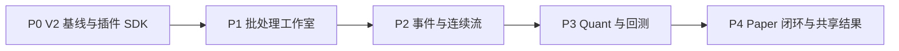

# CoinSphere 工作流平台 V2 开发路线图

- 状态：实施中（In Progress）
- 日期：2026-08-24
- 目标设计：[工作流平台 V2](../architecture/workflow-platform-v2.md)
- 架构决策：[ADR-0002](../architecture/decisions/0002-compile-time-plugin-workflow-platform.md)

本文只维护稳定的能力顺序、交付边界和退出条件。当前分支、Issue、PR、完成状态、验证命令和验收证据以 GitHub 为准，不在本文维护进度百分比。

> P0 已完成并由自动化契约插件通过退出验收，P1 批处理工作室与 P2 事件/连续流已形成当前稳定能力。P3-P4 尚未达到阶段退出条件的能力仍以[架构概览](../architecture/overview.md)、[公共契约](../contracts/README.md)和[使用手册](../user-guide.md)为准；阶段验收证据保存在 GitHub。

## 目标路径

CoinSphere 从现有量化后台重建为工作流优先平台。P0-P2 先证明通用工作流和插件基础，P3-P4 再用 Binance 公共行情、策略、回测和 Paper 完成首个纵向验收。

后续阶段不得通过预留抽象提前进入当前阶段。一个 PR 交付一个可以独立使用、验收和回滚的纵向能力；公共契约、migration、共享配置和依赖锁文件在同一时间保持单一维护者。

## 全局交付规则

- 工作分支使用 `codex/<phase>-<slug>`，PR 标题使用 `[type] 中文描述`。
- Ready PR 以 `main` 为 base；依赖未合并代码的 stacked PR 保持 Draft 并指向父分支。
- 每个切片同时包含所需 API、数据库、前端、权限、日志和最小自动化测试，不为单个校验或内部步骤单独拆 PR。
- 新接口进入 `/api/v1`；时间统一 UTC，Decimal 使用数据库 `NUMERIC(38,18)`、Go `shopspring/decimal` 和 JSON 十进制字符串。
- 输入校验位于 API、事件、外部连接、文件和密钥等信任边界；领域和数据库继续保证自身不变量。
- 只有状态拥有模块记录结构化日志；密钥、令牌、原始载荷和个人数据不得进入日志、测试或验收证据。
- 同一交付不重复执行同一验证。纯文档使用链接、Markdown、`git diff --check` 和只读引用复审；实现按[质量门禁](../quality/quality-gates.md)选择检查。
- 每完成一个阶段，再更新架构概览、公共契约、使用手册和 Runbook 中已经成为事实的部分；不得提前把提议写成现状。

## P0：V2 基线与插件 SDK

### 结果

系统使用 `Vue Web + Go App + PostgreSQL/TimescaleDB` 的新基线启动。认证、RBAC 和系统监控可用；Python Worker、新闻、Testnet/Live 和 Private Executor 不再属于部署或数据模型。可信本地插件可以通过统一 CLI 被校验、编译、迁移和注册。

### 建议交付切片

| 切片                    | 可直接验收的能力                                                                                              |
| ----------------------- | ------------------------------------------------------------------------------------------------------------- |
| P0-A 新数据与部署基线   | 空库建立 V2 核心 schema，Compose 只启动 migration、Go App、Web 和 TimescaleDB；保留登录、RBAC、菜单和系统监控 |
| P0-B 插件清单与静态注册 | `coinsphere-plugin.json`、Core/SDK SemVer 校验、Go/Vue 生成注册表和重复 ID/类型冲突检查                       |
| P0-C 插件迁移与生命周期 | 插件独立 schema/迁移账本，以及 validate/install/upgrade/uninstall/purge-data 的完整行为和失败保护             |
| P0-D 最小契约插件       | 一个测试用本地插件贡献 HTTP Action、Schema、作用域 API 和结果页，由 SDK 契约测试工具证明静态扩展边界          |

P0-A 是其他切片的基础。P0-B 固定 manifest 和 SDK 公共类型后，P0-C 与 P0-D 才能开始；涉及 manifest、生成注册表和依赖锁的变更保持同一维护者。

### 退出条件

- [ADR-0002](../architecture/decisions/0002-compile-time-plugin-workflow-platform.md) 在开始实现时从 `Proposed` 改为 `Accepted`，并记录接受日期。
- 明确确认目标数据库没有需保留的 Paper 证据；开发数据按 Runbook 重置，不存在旧表或旧 API 兼容迁移器。
- 单一 V2 初始化 migration 通过空库 Up、重复 Up、Down 和重新 Up；插件 schema 使用独立版本账本。
- Compose 不包含 Python Worker、Worker 卷或 Private Executor，首次启动和分钟级升级停机均有可执行 Runbook。
- 超级管理员可以登录并查看系统健康；普通用户无法获得未授权的系统或插件管理能力。
- `plugin validate` 能在不修改仓库时报告清单、SemVer、Schema、迁移和注册冲突。
- 安装或兼容升级能生成注册表、执行迁移并完成重建；失败保持旧构建和数据库版本可诊断。
- 有活动引用时卸载被拒绝并列出引用；正常卸载保留插件 schema；`purge-data` 只能在无引用且明确确认后执行。
- 最小契约插件完成“校验 → 安装 → 静态注册 → 注入测试上下文执行 Action → 查询结果路由 → 卸载保护”的 SDK 自动化验收，且不依赖 P1 画布，也不成为生产菜单中的长期示例功能。

### 本阶段不做

不实现完整画布运行、事件流、Quant、Paper、插件市场、签名、沙箱、热加载或独立插件进程。

## P1：批处理工作室

### 结果

超级管理员可以从模板或最小空白图创建批处理工作流，在同一工作台完成连线、Schema 配置、显式保存、启动、观察和排障。每次保存产生不可变修订，每个手工或定时触发产生可重放批次。

### 建议交付切片

| 切片                        | 可直接验收的能力                                                                                |
| --------------------------- | ----------------------------------------------------------------------------------------------- |
| P1-A 工作流、修订与生命周期 | Workflow/Revision/Runtime 模型，模板创建，单触发器，save/start/pause/archive API 和原子修订切换 |
| P1-B Schema 工作台          | 左列表、中央 X6 画布、右检查器、JSON Schema/UI Schema 表单、结构化字段映射和 CEL 校验           |
| P1-C 批次与检查点           | 手工/定时触发、stream/compute 池、节点运行、稳定操作键、检查点、失败节点重试和协作取消          |
| P1-D 历史与制品             | 底部活动时间线、批次完整路径、30 天默认保留、日志摘要和 SHA-256 内容寻址制品                    |

P1-A 固定修订和生命周期后，工作台与执行器可以并行开发；P1-B 合入前只允许一个分支修改图契约和生成表单公共类型。

### 退出条件

- 一个工作流只有一个主触发器和一个运行实例，支持 `batch/event/stream` 模式字段，但本阶段只启用 batch 触发。
- 图校验覆盖端口、不可达节点、Schema、类型化映射、CEL、禁止任意环路及结构化 Loop 配置格式。
- UI 不要求用户编辑 `entryKey`、原始 JSON 或内部运行入口；模板和最小空白图均能产生有效初始修订。
- 显式保存只在完整校验通过后创建修订并原子切换；运行批次固定旧修订，失败保存不影响旧运行。
- 密钥按修订、`nodeInstanceId` 和字段独立加密；修订、日志、导出、快照和复制操作不包含密钥值。
- 有状态节点的兼容修改保留状态，复制创建新状态，破坏性修改要求暂停、领域校验和显式重置。
- 节点失败从最后成功检查点继续，重试不重复已完成节点；副作用节点以稳定操作键建立幂等约束。
- 管理员能从工作台定位批次、节点尝试、耗时、错误和制品；归档后历史只读且不可重新启动。
- 桌面工作台完成用户视觉验收；移动编辑 URL 转到只读活动视图，不出现控件重叠或不可读长文本。

### 本阶段不做

不启用长连接触发器、事件分区并发、人工等待、Quant 或普通用户结果共享。

## P2：事件、连续流与通用官方插件

### 结果

工作流可以消费 CloudEvents 或由长运行 Trigger 持续产生事件。PostgreSQL 提供有界队列、分区顺序、背压和重启恢复；工作台通过 WebSocket 和游标查看实时活动。Connector 与 AI 插件证明通用采集和动作能力。

### 建议交付切片

| 切片                        | 可直接验收的能力                                                                         |
| --------------------------- | ---------------------------------------------------------------------------------------- |
| P2-A CloudEvents 与持久投递 | CloudEvents 1.0、事件唯一性、Outbox、工作流投递、分区键和至少一次语义                    |
| P2-B 连续流与背压           | TriggerHandler 生命周期、长连接暂停/恢复、按分区领取、有界并发、积压保护和重启恢复       |
| P2-C 等待、循环与故障流     | 持久人工任务、释放执行/分区容量、信号取代、Loop 上限、标准失败事件和故障模板             |
| P2-D 活动与诊断重放         | 持久活动游标、WebSocket 增量、断线补齐、固定输入/修订重放和副作用禁用                    |
| P2-E Connector 与 AI        | HTTP/Webhook/WebSocket Connector、模型调用节点、节点本地密钥、结构化输入输出和插件结果页 |

### 退出条件

- `(source,id)` 去重，投递为至少一次；同分区非等待批次保持顺序，不同分区受限并发。
- 达到工作流或全局背压上限时不产生无界内存缓冲，TriggerHandler 可以等待、暂停并在恢复后继续。
- 进程在事件入队、节点执行、检查点或 Outbox 任一点退出后，重启不会丢失已提交事实或重复业务副作用。
- 人工等待保存上下文并释放执行池与分区；批准、拒绝、过期和取代各自只能提交一次且可审计。
- Loop 强制正数迭代上限、绝对超时和退出条件；图级后向边始终被拒绝。
- 最终失败终止批次并发布标准失败事件；故障工作流可以据此通知或归档，不要求每个节点维护错误边。
- 诊断重放固定原事件和修订，明确禁用 notification、human_action 和 paper 副作用。
- WebSocket 中断后从最后活动游标补齐，无需把 WebSocket 当作事实源。
- Connector 不能调用 Binance 私有交易接口；AI 节点不能拥有交易或工作流生命周期权限，密钥不进入日志和结果。
- 在记录硬件信息的参考 Compose 环境完成：20 个活动工作流、100 个分区、持续 10 事件/秒；50 事件/秒持续 60 秒后 5 分钟内清空积压，无事件丢失和重复业务副作用。

### 本阶段不做

不为容量测试引入消息代理、多实例协调或自动扩缩容；不实现策略、行情或 Paper 领域。

## P3：Quant、Binance 公共行情与回测

### 结果

官方 Quant 插件提供 Binance Spot/USD-M 公共行情、可信 Go 策略、回测和结果页。实时和回测直接调用相同策略实现，共享行情采集工作流稳定地产生闭合 K 线事件。

### 建议交付切片

| 切片                    | 可直接验收的能力                                                                           |
| ----------------------- | ------------------------------------------------------------------------------------------ |
| P3-A Quant 插件数据基线 | `plugin_quant` schema、品种/周期/闭合 K 线、Decimal/UTC 契约、Timescale 生命周期和结果 API |
| P3-B Binance 共享采集   | Spot/USD-M 公共 REST/WebSocket、订阅合并、断线补数、闭合 K 线幂等及平台级采集模板          |
| P3-C Go 策略契约        | 策略描述符、参数 Schema、闭合 K 线回看、只读上下文、Decimal 目标和取消要求                 |
| P3-D 回测与结果页       | compute 池回测、下一 K 线开盘成交、费用/滑点、内容寻址明细及回测/策略结果组件              |

### 退出条件

- Quant 是普通编译期插件，不通过核心私有注册或旁路数据库任务执行；部署中不存在 Python Worker。
- Binance Spot/USD-M 元数据和闭合 K 线使用 UTC 与 Decimal；重复消息、重连和 REST 补数不会产生重复 K 线。
- 共享采集工作流按 `market + instrument + interval` 发布 `market.candle.closed`，多个策略不建立重复 WebSocket 订阅。
- 策略只接收升序、无重复、已闭合 K 线、类型化参数和只读上下文，返回 Decimal 目标，不访问数据库或产生副作用。
- 给定相同 K 线清单、策略版本和参数，实时评估与回测的每次策略调用输出一致。
- 回测信号只在下一根 K 线开盘成交，并明确应用费用和滑点；测试覆盖最后一根无下一开盘、不足回看和数据缺口。
- 回测摘要可查询，完整明细和 SHA-256 清单可下载、校验和重放；大输出不进入运行日志。
- 管理员可在工作台观察采集与回测批次，并从插件结果页查询行情、策略和回测结果。

### 本阶段不做

不实现信号审批、Paper 账本、Testnet、Live、私有凭据或在线策略源码编辑。

## P4：信号、Paper、通知与共享结果

### 结果

默认 Paper 模板完成“策略评估 → 信号持久化 → 人工/自动决策 → 风控 → Paper 执行 → 通知”的可观察闭环。普通用户通过固定范围结果视图查看被授权结果并执行允许的审批操作。系统完成恢复演练并具备开始 Paper 观察的证据基线。

### 建议交付切片

| 切片                   | 可直接验收的能力                                                              |
| ---------------------- | ----------------------------------------------------------------------------- |
| P4-A 信号与决策        | 信号事实、业务取代键、人工任务、默认人工审批、显式自动模式和审批结果页        |
| P4-B 风控与 Paper 账本 | 每节点独立账户、完整风险上限、新鲜报价复核、订单/成交/费用/持仓事实和幂等投影 |
| P4-C Notification      | 官方通知插件、投递幂等、站内及既有渠道、失败结果和诊断重放禁用                |
| P4-D 共享结果视图      | 固定插件页面/范围/过滤器、操作白名单、用户/角色授权、撤销和普通用户导航       |
| P4-E 恢复与观察门禁    | 重启/积压/检查点/账本重建/插件升级演练、迁移冻结记录和 Paper 观察证据模板     |

### 退出条件

- Paper 模板默认创建共享行情采集流和策略执行流两个工作流；回测继续使用独立模板。
- 每个 Paper 节点按 `workflowId + nodeInstanceId` 拥有独立账户和账本；复制节点创建新账户，兼容修订保留原账户。
- 默认人工审批。自动模式只有在最大总名义价值、单品种名义价值、单次操作名义价值、最大日亏损和最大回撤全部明确配置后才能启用。
- 审批或自动放行后重新获取公共报价，并检查任务状态、报价新鲜度、账户状态、数量步进和全部风险上限；任何失败都不会产生部分账本事实。
- 新信号按配置业务键取代旧待处理任务；旧决定不能在取代、过期或已决定后再次提交。
- 操作键和数据库唯一约束保证进程崩溃、节点重试、Outbox 重投和通知重投不会生成重复信号、成交、账本或通知。
- 普通用户没有工作流菜单或 API 权限，只能访问获授权的 active ResultView；不能修改固定范围、枚举其他视图或看到源工作流标识。
- 结果页操作同时受 ResultView 操作白名单、RBAC 和领域状态约束；审批、拒绝、重试、取消、暂停和导出分别覆盖允许与拒绝测试。
- 移动端监控、结果和审批完成用户视觉验收；工作流编辑仍为桌面专用。
- Go App、数据库或主机重启后，积压、等待任务和 Paper 投影可恢复，且不存在重复副作用或无法解释的状态。
- 在开始记录正式 Paper 观察证据前记录 migration 冻结提交；冻结后核心与插件 migration 只追加。
- 用户确认恢复演练、风险门禁和观察证据格式满足开始 Paper 观察的要求。完成 P4 不自动创建 Testnet/Live 阶段。

### 本阶段不做

不调用 Binance 私有 API，不存储真实交易凭据，不启动 Testnet/Live，不由 Codex、CI、工作流或 AI 自动解除任何交易门禁。

## 跨阶段验收矩阵

| 能力                   | P0       | P1           | P2                | P3           | P4                              |
| ---------------------- | -------- | ------------ | ----------------- | ------------ | ------------------------------- |
| 新数据/部署基线        | 完成     | 回归         | 回归              | 回归         | 冻结                            |
| 插件安装与版本生命周期 | 完成     | 回归         | 官方通用插件      | Quant 插件   | Notification 插件与重大升级演练 |
| 工作流编辑与修订       | 契约     | 完成         | 事件模式          | Quant 模板   | Paper 模板与移动只读            |
| 批次、检查点和重放     | 基础执行 | batch        | event/stream/等待 | compute 回测 | Paper 副作用与恢复              |
| 结果页与权限           | 契约页   | 管理员基础页 | 插件页            | Quant 页     | 固定共享视图                    |
| 金融 Decimal/UTC       | 数据类型 | 映射限制     | 事件契约          | 行情/回测    | 账本/风险                       |
| 容量与恢复             | 启动恢复 | 节点恢复     | 完整容量基线      | 行情缺口恢复 | Paper 账本与观察证据            |

## Migration 冻结与发布

P0 可以重写未投产 migration，并明确重置 CoinSphere 开发数据，不提供旧数据转换。P1-P4 在正式 Paper 观察开始前仍可整理尚未投产的 migration，但每次破坏性调整必须重新跑空库基线和领域保护测试。

开始记录 Paper 晋级证据前必须：

1. 完成 P4 所需核心和插件 schema；
2. 通过空库、升级、备份恢复和账本重建验证；
3. 在 GitHub Issue、Git 标签或发布记录中标记冻结提交；
4. 更新迁移 Runbook，宣布此后只追加 migration。

发布和部署默认不触发。插件安装或 migration 允许分钟级维护停机，继续执行先备份、再 Up、应用回滚不自动 Down 的策略。

## 明确延期

- Binance Testnet、Spot Live、USD-M Live 和所有私有 API。
- 插件签名、市场、远程安装、热加载、沙箱、独立插件宿主和第三方不可信代码。
- 多实例集群、Kafka、Redis、外部队列、Kubernetes 和自动扩缩容。
- 在线 Go/Python 策略编辑、Python Worker 和任意代码执行。
- 新闻专属领域、旧接口、旧数据、旧工作流图和多数据库兼容。

只有已实现需求和测量证据突破当前边界时，才新增 ADR 和路线图阶段。真实交易必须独立设计安全、凭据、风控、对账、恢复和用户手工放行，不能作为 P4 的隐含后续步骤。
