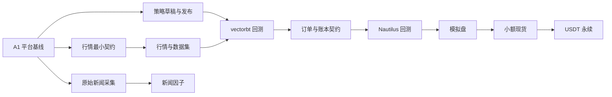

# CoinSphere 路线图

## 产品方向

CoinSphere 从通用后台与工作流系统演进为个人币圈量化平台。首轮支持 Binance、OKX、现货和 USDT 永续逐仓双向持仓；不支持逐笔成交、完整盘口、跨交易所套利、多标的组合、币本位、全仓、高频交易、高级算法单或 AI 自主交易。

路线图只记录目标、依赖和放行门禁。交付进度、当前分支和 PR 状态以 GitHub [Pull Requests](https://github.com/CoderLTS/coinsphere-go/pulls) 与 [Milestones](https://github.com/CoderLTS/coinsphere-go/milestones) 为准，不在仓库内维护百分比或状态副本。完整交付规则见 [全流程实施计划](./implementation-plan.md)。

## 能力依赖

- A1 完成后，行情最小契约、策略草稿与发布、原始新闻采集可以并行推进。
- vectorbt 只依赖已发布策略和可复现数据集；新闻采集、LLM 标注或新闻因子不得阻塞首个量化闭环。
- Nautilus 回测依赖 vectorbt 已验证的订单与账本契约，避免两个引擎各自发明交易语义。
- 模拟盘、小额现货和 USDT 永续严格串行放行；开发并行不得缩短观察期或人工审批。

## 里程碑

| 里程碑 | 主要结果 | 前置依赖 |
| --- | --- | --- |
| A0 工程系统 | CI、规则、ADR、契约、发布与回滚入口 | 无 |
| A1 平台基线 | PostgreSQL、并发事务、安全边界和可观测性 | A0 |
| A2 行情底座 | 双所规范化行情、共享存储/runner、补数和市场界面 | A1、行情最小契约 |
| A3 研究输入 | 不可变数据集、原始新闻和版本化新闻因子 | A1；数据集另依赖 A2 |
| A4 策略与向量回测 | 策略草稿/发布、隔离 Worker 和 vectorbt | 已发布策略、可复现数据集 |
| A5 事件回测 | 订单/账本契约、NautilusTrader 和双引擎比较 | A4 |
| A6 内置模拟盘 | 虚拟账户、撮合、风控、恢复和对账 | A5 |
| A7 小额现货 | 双所现货连接、幂等执行、恢复和急停 | A6 放行 |
| A8 USDT 永续 | 逐仓双向仓、条件单和合约风险 | A7 放行 |

里程碑名称用于组织验收，不要求内部能力严格串行。不存在依赖且文件所有权互斥的工作按开发波次并行，具体分工和验证方式见实施计划。

## 阶段门禁

- 研究版本以可复现的 vectorbt 与 NautilusTrader 双回测为退出条件。
- 模拟盘连续运行 30 天且至少完成 100 个订单、无未解释账务差异，才能申请现货放行。
- 小额现货连续稳定 30 天后才能申请永续放行。
- 每个开发波次只执行一次完整集成验证和一次最终只读复审；每个 PR 仍由用户审查并手工合并。
- 新交易能力默认关闭，任何阶段晋级都不得绕过风控、观察期或用户手工确认。
