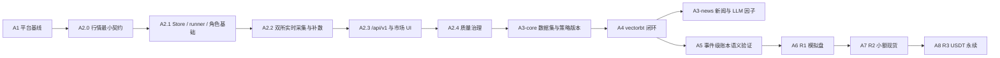

# CoinSphere 路线图

## 产品方向

CoinSphere 从通用后台与工作流系统演进为个人币圈量化平台。目标保留 Binance、OKX、现货、USDT 永续、研究回测、模拟盘和小额实盘；首轮不做逐笔/完整盘口、高频、跨所套利、复杂算法单或 AI 自主交易。

本目录只记录稳定目标、依赖和退出条件。交付进度、当前分支、Issue 和 PR 状态以 GitHub [Milestones](https://github.com/CoderLTS/coinsphere-go/milestones)、[Issues](https://github.com/CoderLTS/coinsphere-go/issues) 与 [Pull Requests](https://github.com/CoderLTS/coinsphere-go/pulls) 为准，不在仓库维护百分比或状态副本。

## 能力依赖

- A3-news 在 vectorbt 闭环后实施，不阻塞 A5 或 A6；只有使用新闻因子的策略才依赖它。
- A5 是进入模拟盘前的必经语义验证门。NautilusTrader 只在权威账本出现可复现差异时启用，并只保留触发差异的黄金案例。
- 里程碑用于组织能力，不要求编号严格串行；稳定依赖以本路线图和 ADR 为准，具体任务拆分与动态状态以 GitHub 跟踪 Issue 为准。

## 里程碑

| 里程碑 | 稳定结果 | 关键前置 |
| --- | --- | --- |
| A0 工程系统 | 规则、CI、发布与回滚入口 | 无 |
| A1 平台基线 | PostgreSQL、并发、安全和可观测性 | A0 |
| A2 行情底座 | 双所规范化行情、修复闭环、市场 API/UI | A1 |
| A3 研究输入 | 不可变数据集、策略版本、后置新闻因子 | A2；新闻因子另依赖 A4 |
| A4 策略与向量回测 | 隔离 Worker、vectorbt、统一结果 | A3-core |
| A5 账本语义验证 | 黄金案例与事件级权威账本验证 | A4 |
| A6 R1 模拟盘 | 虚拟账户、撮合、风控、恢复和对账 | A5 |
| A7 R2 小额现货 | 双所现货连接、幂等执行和急停 | A6 放行 |
| A8 R3 USDT 永续 | 逐仓双向仓、条件单和合约风险 | A7 放行 |

## 放行摘要

- R1：A5 黄金案例通过后由用户手工启用模拟盘。
- R2：模拟盘连续运行至少 30 天且完成至少 100 笔订单，无未解释账务差异，恢复与急停演练通过。
- R3：小额现货稳定至少 30 天，并另完成永续模拟/Testnet 至少 30 天和 100 笔订单。
- 所有账户风控上限必须显式配置；策略只能使用相同或更严格的限制。合并代码不等于获得交易权限。
