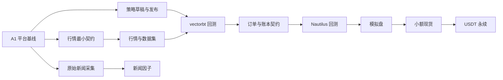

# CoinSphere AI 全流程实施计划

本文件只记录稳定的产品边界、依赖、交付方式和验收门禁。交付进度、当前分支和 PR 状态以 GitHub [Pull Requests](https://github.com/CoderLTS/coinsphere-go/pulls) 与 [Milestones](https://github.com/CoderLTS/coinsphere-go/milestones) 为准。

## 1. 交付与治理

Codex 负责需求细化、架构设计、实现、必要验证、文档、排障和发布产物。用户负责产品方向、高风险取舍、PR 审查、生产凭据注入、手工合并和交易阶段放行。

- `main` 只接受用户手工合并的 PR，禁止直接提交、自动合并和 AI 自主交易。
- 分支使用 `codex/<phase>-<slug>`。一个 PR 交付一个可直接使用、可独立验收和回滚的纵向能力，不为单个内部步骤拆 PR。
- Ready PR 必须以 `main` 为 base；依赖尚未合并的堆叠 PR 只能保持 Draft 并指向父分支，父 PR 进入 `main` 后才能 rebase 并转 Ready。
- migration 默认跟随所属纵向能力；只有共享数据库基线、破坏性删除或跨领域 schema 变更使用独立 PR，并附回滚说明。
- 每个 PR 只记录目标、公共接口或 migration 影响、验证结果、风险和回滚；没有界面变化时不制作界面证据。
- 需求、ADR、API 契约、自动化测试和代码是事实来源，聊天上下文不能成为唯一设计依据。
- Basic Memory 保存个人偏好、模型路由和本地环境；`AGENTS.md` 保存仓库不变量；契约与 ADR 保存在仓库；动态状态只保存在 GitHub。
- 真实交易所密钥不得进入代码、日志、测试、Issue、PR、CI 或 AI 上下文。生产发布只能由用户手工触发受保护的 `production` Environment，且不得自动执行真实交易。

### 1.1 开发取舍与可读性

- 只在 API、外部数据、URL、文件、凭据、金融状态和数据库约束等信任边界校验；内部函数依赖已验证的类型和状态。
- 项目按全新系统开发，允许重置未投产数据；不增加旧 schema、旧数据、旧接口或多数据库兼容层。
- 只抽取当前已有两个真实实现共同需要的接口。没有第二个实现时使用具体类型，不建设插件平台或单实现 Repository。
- 新增或修改的非平凡代码使用准确的中文注释或 Docstring，只说明设计目的、状态转换、并发/事务边界、失败处理和回滚语义。
- Go 语法、类型断言和框架教学集中到 [Go 入门笔记](../../backend/GO入门笔记.md)。修改旧文件时删除触及区域的教学式注释，不单独发起全仓注释清理。
- 仅当两个 Agent 会修改同一文件，或文件新增第二项独立职责时拆分文件，不按行数机械拆包。
- 新增运行流程使用结构化日志覆盖启动、停止、关键状态、外部调用、重试、取消、失败和终态；日志不得包含凭据、令牌、原始载荷、个人数据或运行时环境值。

### 1.2 Agent 并行协议

每个开发波次固定采用一个根 Agent 和最多三个子 Agent，并发数为 `min(3, 独立切片数, 可用槽位 - 1)`。预计不足 20 分钟、存在串行依赖或需要修改共享核心的任务由根 Agent 直接完成。

根 Agent 独占公共契约、migration、共享配置、依赖锁文件、计划文档、临时集成分支、冲突解决、完整验证和最终只读复审。子 Agent 必须从同一个已记录的 base commit 开始，并拥有互斥的允许修改路径。

每张任务卡必须包含：

| 字段 | 要求 |
| --- | --- |
| Base commit | 所有并行切片共同且不可歧义的 SHA |
| 目标 | 一个可独立验收的行为结果 |
| 输入/输出契约 | 已冻结的类型、API、事件或样本 |
| 允许修改路径 | 子 Agent 独占的文件集合 |
| 禁止修改路径 | 共享核心、其他切片和生成产物 |
| 验收命令 | 本切片唯一一次快速验证 |
| 回滚方式 | revert、migration down 或功能开关 |

执行方式：

1. 真正独立的切片从同一 base 扇出，各自使用独立 worktree。
2. 有依赖或文件重叠的任务使用堆叠流水线；下游可在上游 Draft 检查通过后开始，但上游进入 `main` 前不得转 Ready。
3. 波次结束时，根 Agent 创建临时集成分支，合并全部切片头提交，只执行一次完整门禁和一次最终只读复审；临时分支不替代各 PR 的用户手工合并。
4. 波次报告记录越界修改、共享文件冲突和集成后行为返工。任一项出现时，下一波次并发数降低一级；连续三个波次均为零后才允许恢复，但不超过三个子 Agent。

### 1.3 验证投入

- 核心自动化测试覆盖金融 Decimal/UTC、数据库约束与 migration、并发事务、SSRF/Auth、采集去重补数、订单状态机、风控、账务和对账。
- Bug 修复只增加一个覆盖根因的回归检查。CRUD、DTO 映射、简单配置、日志包装、普通 UI 和工作流/通知胶水不新增单元测试。
- PR 快速层按变更路径运行，目标中位反馈不超过 5 分钟；Secret scan 始终运行，依赖扫描只在锁文件变化、`main`、定时任务或发布时运行。
- 相关前端 PR 只运行 Chromium 冒烟。三浏览器、Race、PostgreSQL/TimescaleDB Compose、容器和跨模块集成只在波次临时集成分支及 `main` 运行一次。

## 2. 产品范围

### 2.1 核心范围

- Binance 与 OKX 双交易所。
- 现货、USDT 永续逐仓双向持仓。
- 内置模拟盘；实盘按模拟盘、小额现货、USDT 永续顺序放行。
- vectorbt 向量回测与 NautilusTrader 事件回测。
- Monaco 多文件 Python 策略编辑器。
- PostgreSQL/TimescaleDB 在线数据和不可变 Parquet 数据集。
- 中英双语新闻与版本化 LLM 情绪、相关度和事件因子。
- 保留 RBAC、AI 助手、通知和工作流，不建设 SaaS 多租户、计费或开放注册。

### 2.2 首轮非目标

- 逐笔成交、完整盘口和高频交易。
- 跨交易所套利和多标的组合优化。
- 币本位、全仓和复杂清算模拟。
- OCO、TWAP 等高级算法单。
- AI 自主交易或绕过风控的自动执行。

## 3. 目标架构

- Go 保持模块化单体。新金融代码按 `marketdata`、`dataset`、`news`、`strategy`、`backtest`、`trading`、`risk` 领域组织，不再加入现有 `internal/service.App`。
- 一个 Go 应用二进制和镜像通过 `COINSPHERE_ROLE=api|collector|scheduler|executor` 运行不同常驻角色，不维护四套入口。
- Python Worker 独立运行数据集生成、vectorbt 和 NautilusTrader；Go 与 Python 通过版本化任务参数、资源 ID 和产物 Manifest 交互。
- PostgreSQL/TimescaleDB 是唯一数据库运行栈。任务队列使用 `FOR UPDATE SKIP LOCKED`，领域事件使用事务 Outbox；首版不引入 Redis、Kafka 或 NATS。
- 新 `/api/v1` 使用强类型 DTO。领域金融值使用 `github.com/shopspring/decimal`，数据库使用 `numeric(38,18)`，JSON 使用字符串；`map[string]any` 只留在旧管理接口和动态载荷边界。
- 工作流只编排补数、数据集、批量回测、报告和通知，不参与逐 K 线计算、交易所私有协议或下单。

详细边界见[架构总览](../architecture/overview.md)和[公共契约](../contracts/README.md)。

## 4. 能力依赖与开发波次

### A0 工程系统

目标：提供规则、ADR、契约、CI、发布和回滚入口，使后续金融能力能在干净 checkout 重复验证。

退出条件：适用检查可复现，PR/手工合并约束有自动门禁，发布产物不含凭据，回滚手册完成桌面演练。

### A1 平台基线

目标：消除会放大金融风险的数据库、并发、认证和安全缺陷。依赖顺序为 PostgreSQL 基线、A1 安全波次、A1 可观测性波次；共享核心在上一波进入 `main` 后再开始下一波。

PostgreSQL 基线是共享 migration，单独交付：只保留 PostgreSQL/TimescaleDB 配置、驱动和版本化 SQL，开发数据直接重置。基线必须能从 `main` 追溯，后续 Ready PR 必须 rebase 到包含该基线的 `main`。

A1 安全波次拆成三个可独立验收和回滚的 PR：

| 切片 | 所有权 | 交付与验收 |
| --- | --- | --- |
| SSRF 边界 | 子 Agent 1 | HTTP 节点精确域名 allowlist、公共地址校验、重定向复检和敏感 Header 过滤；核心测试覆盖解析、重定向和地址变化 |
| Auth/会话/WebSocket | 根 Agent 负责后端与共享配置，子 Agent 2 负责前端互斥路径 | Access Token 仅存内存，Refresh Token 使用轮换 HttpOnly Cookie；关闭注册/找回密码并提供管理员 CLI；WebSocket 使用固定 `Sec-WebSocket-Protocol`，禁止查询串 Token |
| 内容清洗/CSP | 子 Agent 3 | Mermaid strict、富文本/Markdown 清洗和 CSP；恶意内容样本不能执行脚本或突破资源策略 |

根 Agent 将 Auth 前后端结果整合为一个 PR；三个安全 PR 从同一 base 扇出，并在临时集成分支执行一次完整安全与浏览器门禁。可观测性放到下一波，由根 Agent 处理应用入口、`internal/api`、`internal/config`、`internal/service` 等共享核心，提供 `log/slog` JSON 日志、请求 ID、持久化审计、有限低基数指标、存活和数据库就绪检查。

退出条件：PostgreSQL 空库可从单一基线启动；SSRF、Auth 轮换、WebSocket 鉴权和内容安全边界有核心检查；审计、指标、存活和就绪接口可用；既有并发与事务契约无回归。

### A2 行情底座

目标：获得可持续运行、可修复的双所行情事实源。

首个契约 PR 只冻结 Decimal/UTC、`Instrument`、`Candle`、`Ticker`、最小 schema、`MarketSource` 和 Binance/OKX 可执行样本；不提前设计完整质量治理、推荐算法、保留策略或 UI 查询模型。规范见[公共契约](../contracts/README.md)。

契约进入 `main` 后从同一 base 扇出四条线：

- 根 Agent：共享 PostgreSQL/TimescaleDB 存储、runner、生命周期、限频、断点和集成。
- 子 Agent 1：Binance 元数据、历史分页和实时行情适配。
- 子 Agent 2：OKX 元数据、历史分页和实时行情适配。
- 子 Agent 3：市场列表、K 线和新鲜度 UI，只消费冻结的 `/api/v1` DTO。

波次集成后再补缺口检测/修复、UTC 聚合、质量报告和品种推荐，除非它们已成为首个可用行情闭环的必要条件。

退出条件：修复后 K 线完整率不低于 99.99%，唯一键重复为零；中断后 30 秒内恢复；补数可重复执行且结果一致。

### A3 研究输入

目标：提供可冻结、可追溯且无未来函数的策略与数据输入。

- 策略草稿、不可变发布版本和引用保护在 A1 后即可开发，不等待行情 UI 或新闻因子。
- 原始新闻采集在 A1 后即可独立开发，先完成来源许可、外部 ID/URL/内容指纹去重以及 `publishedAt`、`ingestedAt`、`availableAt`。
- 不可变 Parquet 数据集依赖 A2 行情，包含 Manifest、内容哈希、分区校验和、质量报告和来源修订号。
- LLM 标注依赖原始新闻并独立版本化；新闻或 LLM 不阻塞 vectorbt，可在研究闭环之后接入因子。

退出条件：策略发布版本不可原地修改；任一数据集可按 Manifest 校验；新闻因子严格使用 `availableAt`。

### A4 策略与向量回测

目标：完成可编辑、可发布、可隔离执行的 vectorbt 闭环。

前置只包括已发布策略和可复现数据集。并行切片为 Monaco 策略体验、Worker 沙箱与 vectorbt、统一回测结果；不等待新闻因子。Worker 使用白名单镜像和锁文件，默认无网络并限制为 2 CPU、4 GB 内存、30 分钟和 5 GB 产物，取消必须回收资源。

退出条件：相同策略、数据集、参数和镜像生成相同交易账本；超时、资源超限和取消均能回收。

### A5 事件回测

目标：在 vectorbt 闭环后冻结 `OrderIntent`、订单状态、成交、仓位、账户账本和费用模型，再由 NautilusTrader 复用同一语义。首轮覆盖市价/限价/止盈止损、GTC/IOC/FOK、`reduceOnly`、逐仓双向仓、手续费、滑点和资金费率；采用保守 Bar 成交，不模拟盘口排队和部分成交。

退出条件：黄金案例账本稳定，关键边界与手工计算一致，双引擎差异可解释，研究版本报告通过用户审查。

### A6 内置模拟盘

目标：使用实时行情验证订单、风控、账务和恢复，不依赖交易所 Demo/Testnet。先冻结虚拟账户、订单状态机、幂等键和订单前风控，再并行模拟撮合、恢复/风险、驾驶舱/通知。

默认限制为：单笔不超过权益 2%，单标的多空毛敞口 10%，总毛敞口 30%，最高杠杆 2 倍；UTC 日亏 2% 或高水位回撤 5% 时禁止新增敞口，只允许 `reduceOnly`。

退出条件：连续运行 30 天且至少完成 100 个订单，无未解释账务差异；任何重试不重复下单，急停后不新增敞口。

### A7 小额现货

目标：用户手工放行后，以最小资金验证双所真实连接和恢复。新交易能力默认关闭，Executor 独占 Secret；Binance、OKX 和公共对账在冻结订单路由与风险边界后并行。

退出条件：Testnet 连接器验证通过；用户手工注入密钥并放行；小额现货连续稳定 30 天后才可申请永续。

### A8 USDT 永续

目标：现货放行后增加逐仓双向持仓、标记价、资金费率、`reduceOnly`、条件单和清算风险。Binance、OKX 和公共风险/监控在合约状态机冻结后并行。

退出条件：模拟和 Testnet 的强平、资金费率、断连、重复回报、未知状态和重启恢复案例全部通过；用户手工放行。

## 5. API 与体验演进

- 默认首屏为交易驾驶舱，展示行情新鲜度、数据缺口、账户净值、毛敞口、风控、任务、自选市场和告警。
- 导航按驾驶舱、市场、数据中心、新闻因子、策略、回测、交易、风险、自动化、系统组织。
- TradingView Lightweight Charts 用于实时 K 线、成交量和交易标记；ECharts 用于绩效与统计。
- 移动端只提供监控、告警、订单仓位、任务取消和急停；编辑器与工作流仅支持桌面端。
- 加载、空数据、部分失败、过期数据、取消中、重试中和只读状态必须有明确反馈。

## 6. CI、发布与供应链

验证分为三层：

1. PR 快速层：按受影响路径执行格式/Lint、编译或类型检查、生产构建和相关核心测试；Secret scan 始终运行，目标中位反馈不超过 5 分钟。
2. 波次集成层：临时集成分支集中运行一次 migration、PostgreSQL/TimescaleDB Compose、跨模块 API、Chromium 关键路径和必要 Race；相关前端 PR 不重复运行三浏览器矩阵。
3. `main`/定时/发布层：运行三浏览器、完整 Race、容器、依赖与供应链扫描、SBOM、校验和、Manifest 和最终发布产物验证。锁文件变化时，依赖扫描也进入 PR 快速层。

数据库只验证 PostgreSQL 空库 Up、当前版本启动和本次 migration 的必要回滚。共享基线建立后，每次结构变更追加版本化 SQL，不修改已应用历史文件，也不为旧数据或其他数据库补兼容路径。

发布流水线从 `main` 构建带版本号和 Commit SHA 的单应用镜像、SPDX JSON SBOM、校验和及发布说明。部署前完成备份和 migration；流程只能由用户手工触发并经过 `production` Environment，真实交易所密钥不进入 GitHub、Runner 日志或发布产物。

## 7. 总体验收门禁

- Ready PR 的 base 为 `main`，提交历史可追溯其依赖的共享基线。
- 新金融领域包不依赖 `internal/api` 或 `internal/service.App`，新金融 API 不使用无类型 Map。
- PR 快速门禁与波次完整门禁各执行一次，非适用的完整门禁不得阻塞普通 PR。
- 回测任务取消在 5 秒内生效，Worker 崩溃后任务可安全回收。
- 任何重试不得产生重复订单，急停后不得出现新增敞口；重启后账户、订单、成交、仓位和余额自动对账。
- 模拟盘与小额现货分别满足观察期和报告门禁，安全、风控和人工放行规则不因开发并行而改变。

## 8. 风险控制

- 交易所协议和限频变化：使用连接器契约检查、脱敏样本、版本监控和降级开关。
- 数据缺口与未来函数：使用质量报告、`availableAt`、不可变数据集和黄金案例。
- 回测与实盘偏差：复用订单意图和账本，采用保守成交假设并执行双引擎对照。
- 重复订单和未知状态：使用稳定幂等键、确定性客户端订单号，并坚持先对账后重试。
- 家用主机故障：依赖备份、就绪门禁、私网访问、固定镜像和演练过的回滚手册。
- AI 交付漂移：依赖最小公共契约、纵向 PR、互斥文件所有权、波次末一次验证与复审，以及用户手工合并。
